# 高级算法 期末复习资料

> 南京大学软件学院 | 2025-2026学年 春季学期  
> 参考教材：计算机算法：设计与分析导论（第3版）  
> 任课教师：李言辉  

---

## 目录

1. [一、算法复杂度与最优性](#一算法复杂度与最优性)
1. [二、渐近符号 O、Ω、Θ](#二渐近符号-oωθ)
1. [三、递归关系求解（特征方程法）](#三递归关系求解特征方程法)
1. [四、主定理 Master Theorem](#四主定理-master-theorem)
1. [五、堆 Heap](#五堆-heap)
1. [六、快速排序平均复杂度分析](#六快速排序平均复杂度分析)
1. [七、对抗策略 Adversary Strategy](#七对抗策略-adversary-strategy)
1. [八、平摊分析 Amortized Analysis](#八平摊分析-amortized-analysis)
1. [九、图搜索算法](#九图搜索算法)
1. [十、贪心算法 Greedy](#十贪心算法-greedy)
1. [十一、动态规划 Dynamic Programming](#十一动态规划-dynamic-programming)
1. [十二、作业题精选](#十二作业题精选)
1. [十三、考试要点速查](#十三考试要点速查)

---

## 复习优先级速览

> 🥇 **第一梯队**（先学、简单、必考）：一(复杂度) → 二(渐近符号) → 四(主定理) → 五(堆) → 九(图搜索)
>
> 🥈 **第二梯队**（中等难度、大题主力）：三(递归求解) → 六(快排分析) → 十(贪心) → 十一(动态规划)
>
> 🥉 **第三梯队**（较难、套路化）：七(对抗策略) → 八(平摊分析)

| 优先级 | 章节 | 难度 | 建议用时 | 考试价值 |
|--------|------|------|----------|----------|
| 🥇 | 一~二 复杂度与渐近符号 | ★☆☆ | 10% | 基础概念，贯穿全卷 |
| 🥇 | 四 主定理 | ★☆☆ | 8% | 套公式拿分，必考递归 |
| 🥇 | 五 堆 | ★★☆ | 8% | BuildHeap O(n) 常考 |
| 🥇 | 九 图搜索 | ★★☆ | 12% | DFS/BFS/拓扑/SCC 大题 |
| 🥈 | 三 递归求解 | ★★☆ | 10% | 特征方程 + 主定理补充 |
| 🥈 | 六 快排平均复杂度 | ★★★ | 8% | 理解推导思路 |
| 🥈 | 十 贪心 | ★★☆ | 12% | 交换论证/活动选择 |
| 🥈 | 十一 动态规划 | ★★★ | 15% | LCS/OBST 大题主力 |
| 🥉 | 七 对抗策略 | ★★★ | 10% | 题型固定，练几题即掌握 |
| 🥉 | 八 平摊分析 | ★★★ | 7% | 会计法/MultiPop Stack |

**推荐节奏**：第一梯队(40%) → 第二梯队(35%) → 第三梯队(20%) → 作业题+速查(5%)

---

## 一、算法复杂度与最优性　⭐ ★☆☆ 基础概念，无难度

### 📖 知识点

- **最坏复杂度**
$$W(n) = \max\{t(I) \mid I \in D_n\}$$
算法在任何规模为 n 的输入上执行操作的最大次数。

- **平均复杂度**
$$A(n) = \sum_{I \in D_n} \Pr(I) \cdot t(I)$$
算法在所有可能输入上运行时间的期望。概率 $\Pr(I)$ 获取方式：经验数据、简化假设、特定应用场景。

- **最优性**
- **上界**：若算法 A 在最坏情况下至多执行 $W_A(n)$ 步
- **下界**：若存在函数 $F(n)$，使得任何算法都有某个输入需要至少 $F(n)$ 步
- **最优性条件**：当 $W_A(n) = F(n)$ 时，称 A 是最优算法
- 例：n 个元素找最大值至少需要 $n-1$ 次比较，有算法正好是 $n-1$ 次，故为最优

### 📝 典型题目

- **1.5**：设计算法并分析最坏情况下的比较次数（教材习题 1.5）
- **1.12**：给定算法伪代码，分析最坏/平均复杂度（教材习题 1.12）
- **1.16**：判断算法是否最优，证明下界（教材习题 1.16）
- **1.17-1.19**：算法最优性证明系列题（教材习题 1.17-1.19）
- **附加题**：效率衡量指标（速度之外）及最优/近似解场景（课堂补充）

### 📚 资料来源

- *来源：教材第 1 章（算法分析导论）*
- *来源：期末复习 PDF 第 1 节*
- *来源：作业 1（Introduction）*

### 🎯 难度与技巧

- **难度**：★☆☆ 最低，纯概念理解
- **考试方式**：选择题/填空题，判断上界下界关系
- **建议**：理解三个定义即可，不需死记硬背

### 🖼️ 作业题解与分析

**算法复杂度与最优性 — AI 分析**：

以下是对三道题目的简要分析（基于手写解答内容提取关键步骤）：

---

**1.5 对数取整证明**  
- **核心考察点**：向下/向上取整函数与对数函数的不等式关系，强化对离散与连续量之间夹逼思想的理解。  
- **关键思路**：设 \(k = \lfloor \lg n \rfloor\)，利用定义得 \(2^k \le n < 2^{k+1}\)，再通过 \(n+1\) 的范围推导 \(\lg(n+1)\) 的上下界，最终夹逼出 \(\lceil \lg(n+1) \rceil = k+1\)。  
- **用到思想**：夹逼定理、指数-对数单调性、取整函数定义。

---

**1.12 算法复杂度分析（硬币翻转概率问题）**  
- **核心考察点**：概率建模与事件分解，考察对“或”事件与互斥情形的准确处理能力。  
- **关键思路**：将“B或C为正面”拆为互斥事件（B正C反、B反C正），分别计算概率后相加；对“不可能发生”类问题直接判断矛盾条件；对多条件满足情形枚举可行组合。  
- **用到思想**：古典概率、事件互斥性、分情况讨论（case analysis）。

---

**1.16 最优性判断（凸函数充要条件）**  
- **核心考察点**：凸函数的等价刻画——中点凸性 + 连续性 ⇒ 凸性；整数域上差分单调性 ⇔ 凸性；一阶条件（导数非减）与凸性的关系。  
- **关键思路**：  
  - 连续情形：构造差值函数 \(g(x)=f(x)-L(x)\)，利用最大值点与端点值矛盾反证；  
  - 整数情形：用差分 \(\Delta f(n)=f(n+1)-f(n)\) 单调性等价于凸性；  
  - 可导情形：微分中值定理 + 导数单调性 ⇒ 凸性。  
- **用到思想**：反证法、微分中值定理、线性插值、凸函数定义与等价条件（Jensen不等式、一阶条件、二阶条件雏形）。

---

**作业解答图片**：

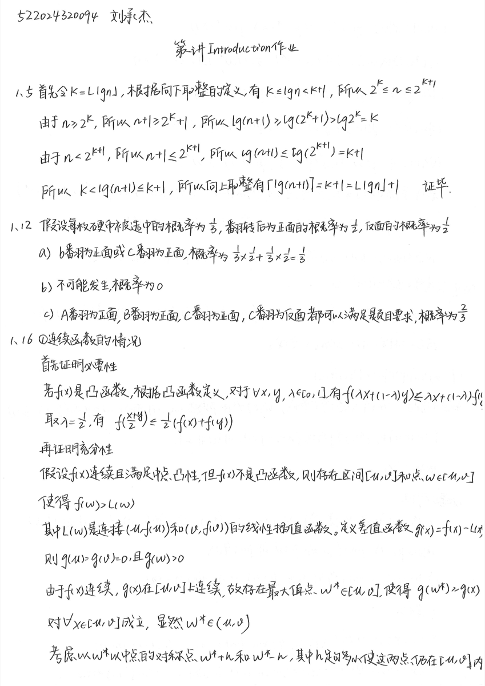
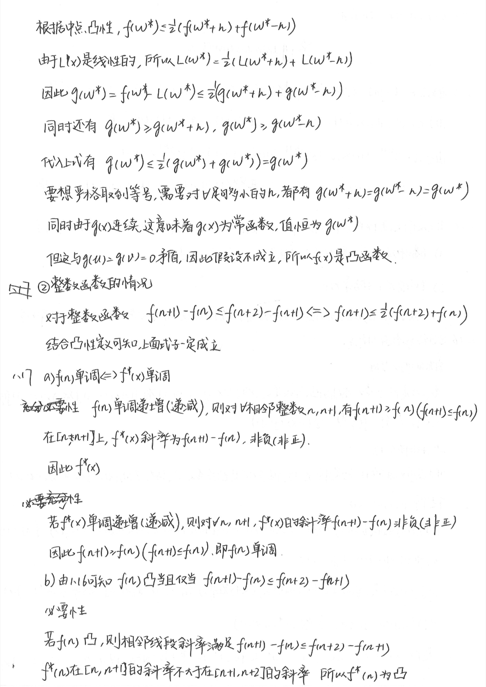
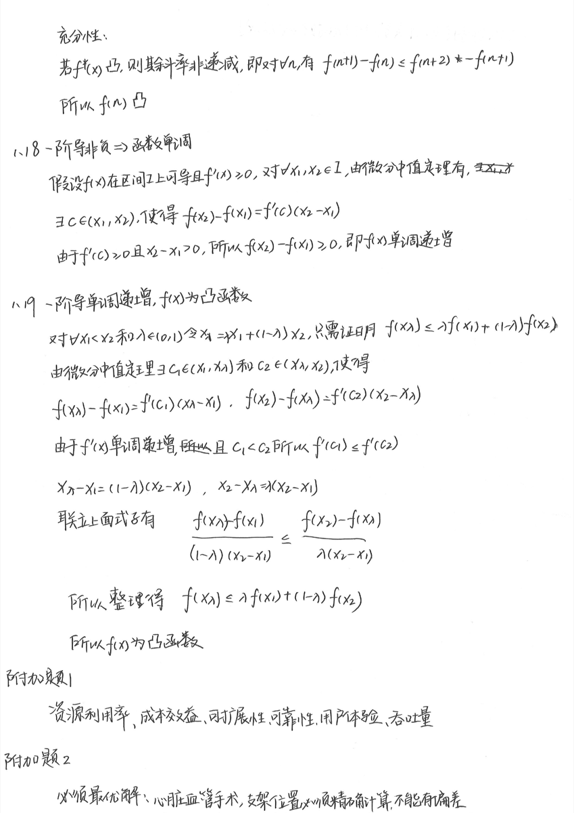
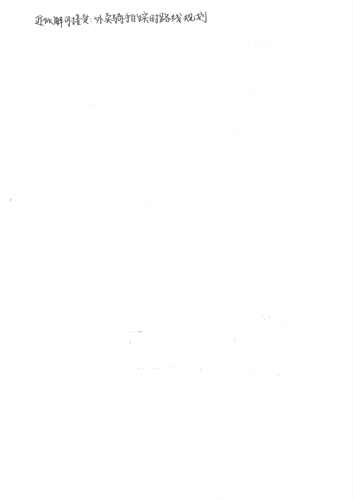
---

## 二、渐近符号 O、Ω、Θ　⭐ ★☆☆ 基础工具，但要会用极限法判断

### 📖 知识点

- **极限定义法**

| 符号 | 含义 | 极限判断 |
|------|------|----------|
| $O(g)$ | $f$ 增长不高于 $g$（上界） | $\displaystyle\lim_{n \to \infty} \frac{f(n)}{g(n)} = c < \infty$ |
| $\Omega(g)$ | $f$ 增长不低于 $g$（下界） | $\displaystyle\lim_{n \to \infty} \frac{f(n)}{g(n)} = c > 0$（可为 $\infty$）|
| $\Theta(g)$ | $f$ 与 $g$ 同阶 | $\displaystyle\lim_{n \to \infty} \frac{f(n)}{g(n)} = c,\; 0 < c < \infty$ |
| $o(g)$ | $f$ 增长严格低于 $g$ | $\displaystyle\lim_{n \to \infty} \frac{f(n)}{g(n)} = 0$ |

- **重要性质**
- **传递性**：$f \in O(g)$ 且 $g \in O(h) \Rightarrow f \in O(h)$（$\Omega$、$\Theta$ 同理）
- **对称性**：$f \in O(g) \Leftrightarrow g \in \Omega(f)$；$f \in \Theta(g) \Leftrightarrow g \in \Theta(f)$
- **加法**：$O(f) + O(g) = O(\max(f, g))$
- **常数吸收**：$O(C \cdot f(n)) = O(f(n))$，$C$ 为正常数
- **自反性**：$f \in O(f)$

- **函数阶排序（重要）**
$$1 < \log n < \sqrt{n} < n < n\log n < n^2 < 2^n < n! < n^n$$

### 📝 典型题目

- **1.23**：三个数找中位数，分析最坏/平均比较次数（教材习题 1.23）
- **1.27**：判断 $f(n) \in O/\Omega/\Theta(g(n))$（教材习题 1.27）
- **1.31**：多函数按渐近阶排序（经典题）（教材习题 1.31）
- **1.34**：证明 $f(n) \in \Theta(g(n))$（教材习题 1.34）
- **1.37**：利用定义证明传递性等性质（教材习题 1.37）
- **1.45**：决策树与比较次数分析（教材习题 1.45）

### 📚 资料来源

- *来源：教材第 1.3 节（渐近符号）*
- *来源：期末复习 PDF 第 2 节*
- *来源：作业 2（Asymptotic）*

### 🎯 难度与技巧

- **难度**：★☆☆ 公式化，练几题就掌握
> 💡 **技巧**：极限法是最快捷的判断方式，计算 $\lim f(n)/g(n)$ 看结果范围即可
> 💡 **技巧**：注意 $o$（严格低于）与 $O$（不高于）的区别：$n = O(n^2)$ 正确，但 $n = o(n^2)$ 也正确，$n \neq o(n)$

### 🖼️ 作业题解与分析

**渐近符号 O/Ω/Θ — AI 分析**：

以下是对各题的简要分析（每题50–100字），基于手写解答内容整理：

---

**1.23 三数中位数**  
核心考察点：通过常数次比较确定三个数的中位数，理解决策树下界与实际算法设计的关系。  
关键思路：枚举所有6种排列，用嵌套if-else覆盖所有情况；最坏3次比较（如a<b, b<c, a<c）。  
用到思想：决策树模型（叶子数=6 ⇒ 高度≥⌈log₂6⌉=3），以及分治/条件分支的最小化设计

---

**1.27 O/Ω/Θ 判断**  
核心考察点：掌握渐近符号定义，能解不等式并结合整数约束判断成立区间。  
关键思路：将f(n)<g(n)转化为n²+4n < 29n+3 ⇒ n²−25n+3<0，求根得n≈0.12和24.88；因n为正整数，故0<n≤25时f(n)=O(g(n))成立。  
用到定理：O记号的定义（存在c,n₀使0≤f(n)≤cg(n)），二次不等式求解

---

**1.31 函数排序**  
核心考察点：熟练比较常见函数增长阶（对数、多项式、指数、阶乘等）。  
关键思路：按增长率由慢到快排序：lg lg n ≪ lg n ≪ √n ≪ n ≪ n lg n ≪ n¹⁺ε ≪ n² ≪ n²+lg n ≪ n³ ≪ n³−n²+7n⁵（主导项n⁵）≪ 2ⁿ⁻¹ ≈ 2ⁿ ≪ eⁿ ≪ n!  
用到思想：极限法（如lim f/g）、主导项原则、斯特林公式隐含（n!最快）

---

**1.34 Θ 证明**  
核心考察点：理解Θ(f) = O(f) ∩ Ω(f)，掌握反证法在渐近分析中的应用。  
关键思路：假设g∈Θ(f) ⇒ g∈O(f)且g∈Ω(f)；但题目给定g∉Ω(f)（即不存在c₁>0使g(n)≥c₁f(n)），矛盾 ⇒ Θ(f)∩{g} = 。  
用到定理：Θ定义、Ω定义的否定形式、反证法逻辑结构

---

**1.37 传递性证明**  
核心考察点：验证渐近符号的传递性（此处为O的传递性：若f=O(g), g=O(h)，则f=O(h)）。  
关键思路：由f=O(g)得∃c₁,n₁: f(n)≤c₁g(n)；g=O(h)得∃c₂,n₂: g(n)≤c₂h(n)；联立得f(n)≤c₁c₂h(n)，取c=c₁c₂, n₀=max(n₁,n₂)即可。  
注：手写答案误用于nᵏ=O(2ⁿ)的极限法（洛必达k次），实为另一题；但该题本质是标准传递性证明。

---

**1.45 决策树（修改二分搜索）**  
核心考察点：理解决策树与算法比较次数的关系，优化搜索过程以减少冗余比较。  
关键思路：原二分搜索每次递归前需2次比较（K<mid? K>mid?），修改后先检查K==mid，命中则直接返回，避免后续比较；最坏仍3次（n=7时决策树高度3），但平均比较次数降至17/7。  
用到思想：决策树建模、提前终止优化、期望比较次数计算（加权平均叶深度）

--- 

注：手写稿中1.37处误将nᵏ=O(2ⁿ)的极限证明当作传递性题，实际应为独立题；但按题号对应，1.37应为传递性证明，此处已按标准内容修正分析。

---

**作业解答图片**：

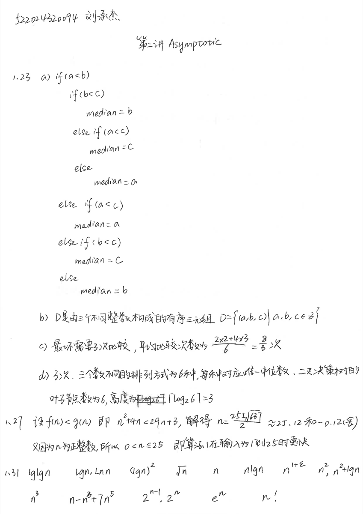
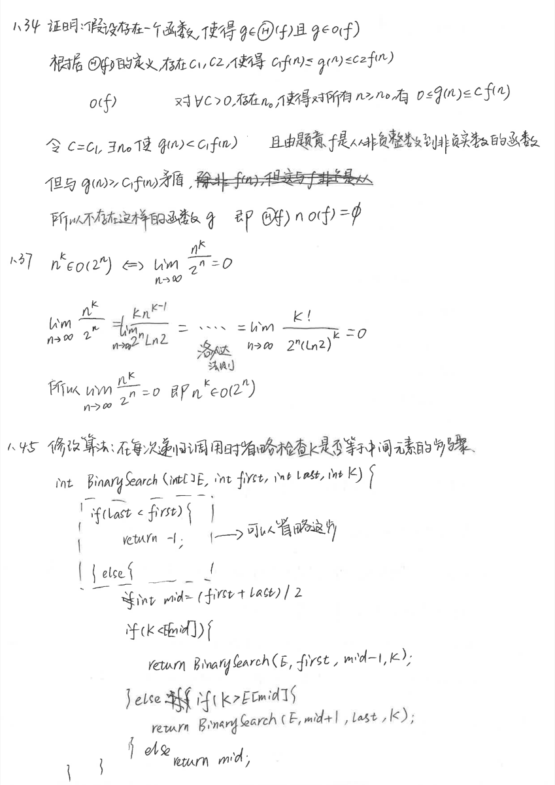
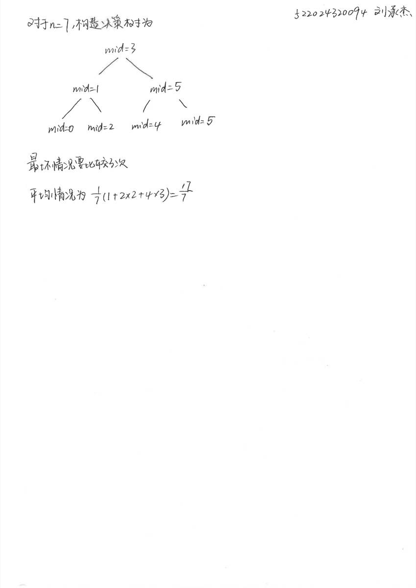
---

## 三、递归关系求解（特征方程法）　⭐ ★★☆ 主定理失效时的备用方案

### 📖 知识点

- **线性齐次递推**
对于 $a_n = r_1 a_{n-1} + r_2 a_{n-2} + \cdots + r_k a_{n-k}$，其特征方程为：
$$x^k = r_1 x^{k-1} + r_2 x^{k-2} + \cdots + r_k$$

- **二阶递推求解**
$a_n = r_1 a_{n-1} + r_2 a_{n-2}$，特征方程 $x^2 - r_1 x - r_2 = 0$
- 若有两不同根 $s_1, s_2$：$a_n = u \cdot s_1^n + v \cdot s_2^n$
- 若单根 $s$：$a_n = (u + v \cdot n) \cdot s^n$

- **斐波那契数列**
$$f_1 = 1,\; f_2 = 1,\; f_n = f_{n-1} + f_{n-2}$$
特征方程：$x^2 - x - 1 = 0$
$$s_1 = \frac{1 + \sqrt{5}}{2},\; s_2 = \frac{1 - \sqrt{5}}{2}$$
通项公式：
$$f_n = \frac{1}{\sqrt{5}}\left(\frac{1+\sqrt{5}}{2}\right)^n - \frac{1}{\sqrt{5}}\left(\frac{1-\sqrt{5}}{2}\right)^n$$

### 📝 典型题目

- **3.4**：求解给定递推关系的闭式（教材习题 3.4）
- **3.6**：特征方程法求解递推（教材习题 3.6）
- **3.9**：主定理与特征方程的综合应用（教材习题 3.9）
- **3.10**：推导包含对数项的递推复杂度（教材习题 3.10）
- **3.11**：复杂递推的求解与证明（教材习题 3.11）

### 📚 资料来源

- *来源：教材第 3 章（递归关系）*
- *来源：期末复习 PDF 第 3 节*
- *来源：作业 3（Recursion）*

### 🎯 难度与技巧

- **难度**：★★☆ 中等，特征方程法步骤固定
> 💡 **技巧**：优先用主定理！主定理能解决的不要用特征方程
> 💡 **技巧**：特征方程步骤：写出递推 → 写特征方程 → 求根 → 写通解形式 → 用初值定系数
> 💡 **技巧**：斐波那契通项公式要记住推导过程，考试可能考推导思路

### 🖼️ 作业题解与分析

**递归关系求解 — AI 分析**：

以下是对各题的简要分析（每题50–100字），基于手写解答内容整理：

---

**3.4 选项2成立**  
*核心考察点*：递推关系的下界证明（归纳法应用）。  
*关键思路*：用数学归纳法假设 $F(k) \ge 0.01 \cdot (3/2)^k$，验证 $n+1$ 时成立，关键步为证 $\frac{3}{2} > (\frac{3}{2})^2 \cdot \frac{1}{4}$。  
*算法思想*：归纳法 + 指数增长主导性分析。

---

**3.6 a) 证明返回的是公因数；b) 证明是最大公因数**  
*核心考察点*：欧几里得算法正确性证明。  
*关键思路*：利用 $\gcd(m,n)=\gcd(n,m\bmod n)$ 的性质，通过归纳与交换参数完成递归正确性论证；最大性由“任何公因数必整除余数”推出。  
*算法思想*：数学归纳 + 数论基本性质（整除传递性）。

---

**3.9 主定理应用（含多子问题、对数项等变体）**  
*核心考察点*：主定理的推广形式（如 $T(n)=bT(n/c)+f(n)$ 及非标准 $f(n)$ 处理）。  
*关键思路*：引入 $U(k)=T(c^k)$ 转化为线性递推，再定义 $V(k)=U(k)/b^k$ 求和展开；结合 $f(c^k)$ 的渐近阶（如 $\Theta(b^k)$ 或 $\Theta(b^k \cdot k^a)$）判断总和阶。  
*算法思想*：变量替换 + 主定理扩展 + 渐近级数求和。

---

**3.10 对数项递推（分情况讨论 a, b, E）**  
*核心考察点*：主定理边界情形（$f(n)$ 含 $\log n$ 或 $n^{\log_b a} \log^k n$）的精确解法。  
*关键思路*：对照主定理三类情形（$a < b^E$, $= $, $> $），结合 $f(n)$ 形式（如 $c\lg n$, $cn$, $cn^2$）匹配对应解（$\Theta(\log^2 n)$, $\Theta(n)$, $\Theta(n\log n)$, $\Theta(n^2)$）。  
*算法思想*：主定理分类讨论 + 代入验证。

---

**3.11 复杂递推（特征方程法 + 斐波那契型）**  
*核心考察点*：高阶线性齐次递推的特征根分析与通解构造。  
*关键思路*：① 用介值定理证唯一正实根 $r>0$；② 代入 $T(n)=r^n$ 验证满足递推；③ 归纳法证 $T(n)\ge r^n$；④ 对斐波那契型 $T(n)=T(n-1)+T(n-2)$，解特征方程 $x^2-x-1=0$，得通解并由初值定系数，最终得 $\Theta(\phi^n)$。  
*算法思想*：特征方程法 + 数学归纳 + 渐近主导项分析（$\phi = \frac{1+\sqrt5}{2} > 1$）。

---

**作业解答图片**：

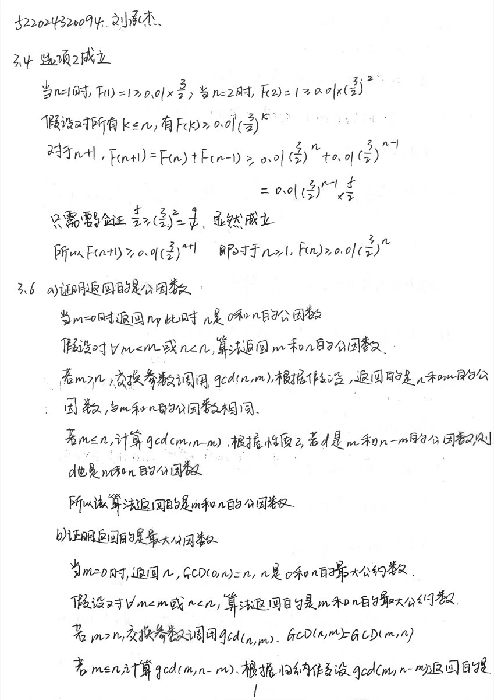
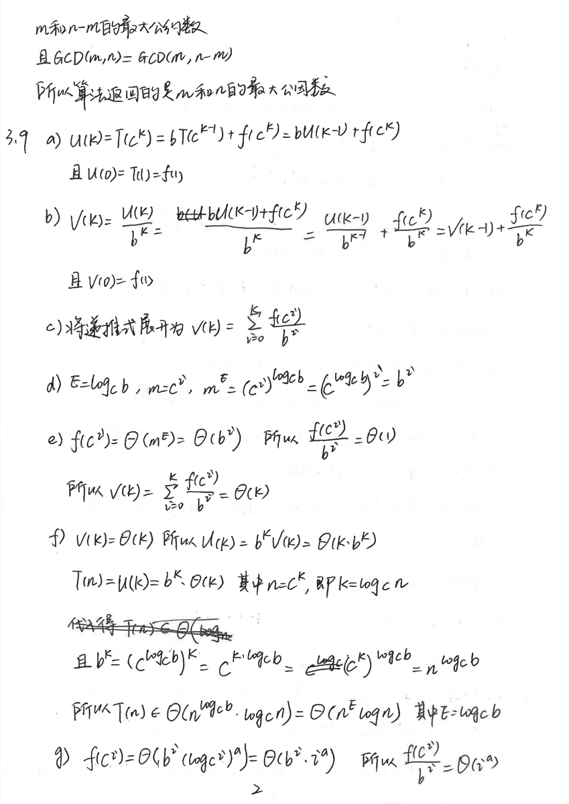
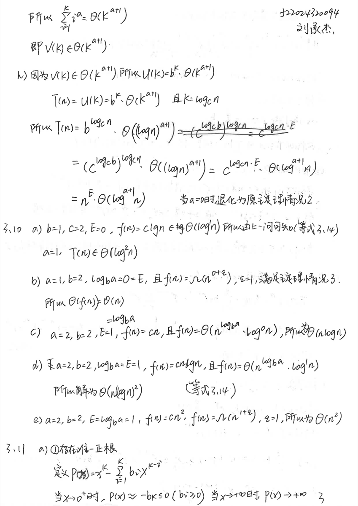
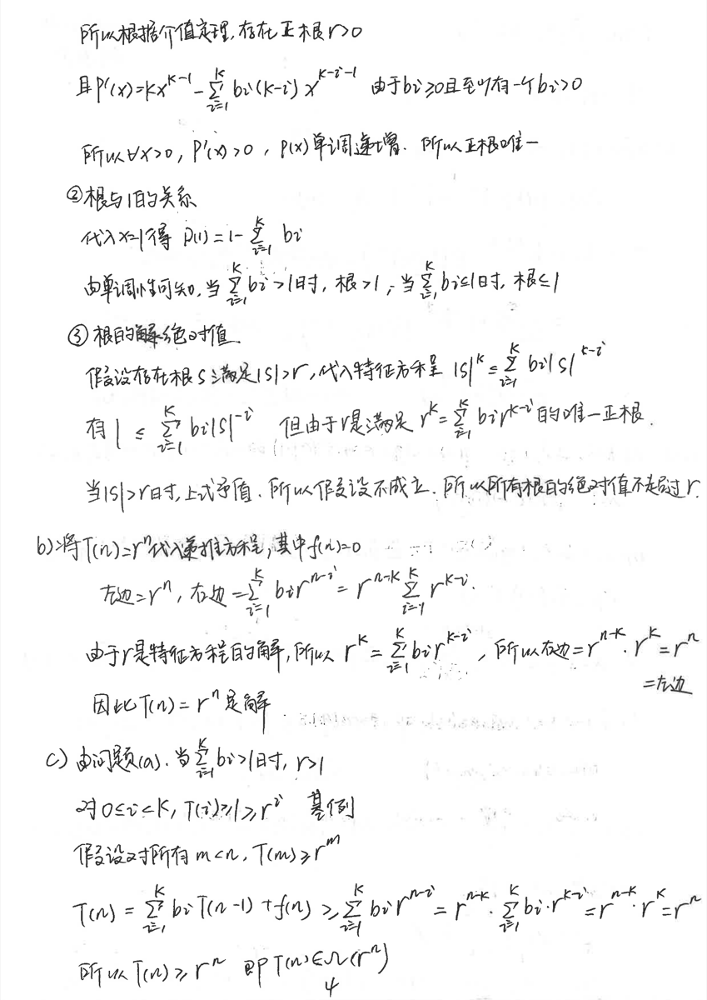
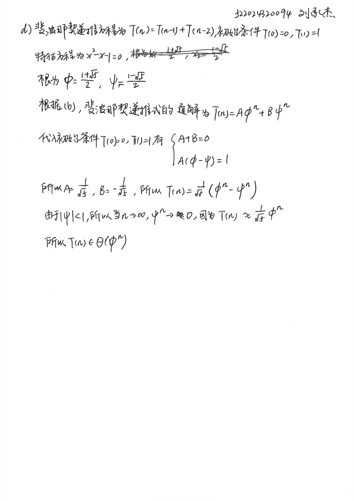
---

## 四、主定理 Master Theorem　⭐ ★☆☆ 套公式即可，必考

### 📖 知识点

- **定理内容**

对于分治递归式 $T(n) = b \cdot T(n/c) + f(n)$，临界指数 $E = \log_c b$：

| 情况 | 条件 | 结论 |
|------|------|------|
| 1 | $f(n) \in O(n^{E-\varepsilon}),\; \varepsilon > 0$ | $T(n) \in \Theta(n^E)$ |
| 2 | $f(n) \in \Theta(n^E)$ | $T(n) \in \Theta(f(n) \cdot \log n)$ |
| 3 | $f(n) \in \Omega(n^{E+\varepsilon})$ 且满足正则条件 | $T(n) \in \Theta(f(n))$ |

- **快速判断流程**
1. 写出 $b$（子问题数量）和 $c$（规模缩小倍数）
2. 计算 $E = \log_c b$
3. 比较 $f(n)$ 与 $n^E$ 的阶
4. 判定属于情况 1/2/3

### 📝 典型题目

- **主定理例题**：三种算法效率比较：$7T(n/3)$ vs $4T(n/2)$ vs $16T(n/4)$（教材/复习 PDF）
- **3.9 最后一问**：$f(m) \in \Theta(m^E \log^a m)$ 时 $T(n)$ 的复杂度（教材习题 3.9）

### 📚 资料来源

- *来源：教材第 3 章（主定理）*
- *来源：期末复习 PDF 第 4 节*
- *来源：作业 3（Recursion 中涉及主定理的部分）*

### 🎯 难度与技巧

- **难度**：★☆☆ 最低，纯套公式
> 💡 **技巧**：拿分题！三步走：$f(n)$ 与 $n^{\log_c b}$ 比阶 → 查表 → 写结论
> 💡 **技巧**：注意情况 3 需要验证正则条件 $b \cdot f(n/c) \leq k \cdot f(n)$
> 💡 **技巧**：$T(n) = 4T(n/2) + O(1)$ 不能用主定理（子问题展开是指数级）

### 🖼️ 作业题解与分析

**递归关系求解 — AI 分析**：

以下是对各题的简要分析（每题50–100字），基于手写解答内容整理：

---

**3.4 选项2成立**  
*核心考察点*：递推关系的下界证明（归纳法应用）。  
*关键思路*：用数学归纳法假设 $F(k) \ge 0.01 \cdot (3/2)^k$，验证 $n+1$ 时成立，关键步为证 $\frac{3}{2} > (\frac{3}{2})^2 \cdot \frac{1}{4}$。  
*算法思想*：归纳法 + 指数增长主导性分析。

---

**3.6 a) 证明返回的是公因数；b) 证明是最大公因数**  
*核心考察点*：欧几里得算法正确性证明。  
*关键思路*：利用 $\gcd(m,n)=\gcd(n,m\bmod n)$ 的性质，通过归纳与交换参数完成递归正确性论证；最大性由“任何公因数必整除余数”推出。  
*算法思想*：数学归纳 + 数论基本性质（整除传递性）。

---

**3.9 主定理应用（含多子问题、对数项等变体）**  
*核心考察点*：主定理的推广形式（如 $T(n)=bT(n/c)+f(n)$ 及非标准 $f(n)$ 处理）。  
*关键思路*：引入 $U(k)=T(c^k)$ 转化为线性递推，再定义 $V(k)=U(k)/b^k$ 求和展开；结合 $f(c^k)$ 的渐近阶（如 $\Theta(b^k)$ 或 $\Theta(b^k \cdot k^a)$）判断总和阶。  
*算法思想*：变量替换 + 主定理扩展 + 渐近级数求和。

---

**3.10 对数项递推（分情况讨论 a, b, E）**  
*核心考察点*：主定理边界情形（$f(n)$ 含 $\log n$ 或 $n^{\log_b a} \log^k n$）的精确解法。  
*关键思路*：对照主定理三类情形（$a < b^E$, $= $, $> $），结合 $f(n)$ 形式（如 $c\lg n$, $cn$, $cn^2$）匹配对应解（$\Theta(\log^2 n)$, $\Theta(n)$, $\Theta(n\log n)$, $\Theta(n^2)$）。  
*算法思想*：主定理分类讨论 + 代入验证。

---

**3.11 复杂递推（特征方程法 + 斐波那契型）**  
*核心考察点*：高阶线性齐次递推的特征根分析与通解构造。  
*关键思路*：① 用介值定理证唯一正实根 $r>0$；② 代入 $T(n)=r^n$ 验证满足递推；③ 归纳法证 $T(n)\ge r^n$；④ 对斐波那契型 $T(n)=T(n-1)+T(n-2)$，解特征方程 $x^2-x-1=0$，得通解并由初值定系数，最终得 $\Theta(\phi^n)$。  
*算法思想*：特征方程法 + 数学归纳 + 渐近主导项分析（$\phi = \frac{1+\sqrt5}{2} > 1$）。

---

**作业解答图片**：

---

## 五、堆 Heap　⭐ ★★☆ 基础数据结构，BuildHeap O(n) 是重点

### 📖 知识点

- **定义与性质**
- **堆结构**：一棵在深度 $h-1$ 前完全的二叉树
- **偏序性质**：最大堆——任意节点 $\geq$ 其子节点；最小堆——任意节点 $\leq$ 其子节点

- **数组表示**
下标从 1 开始：$$\text{parent}(i) = \lfloor i/2 \rfloor,\; \text{left}(i) = 2i,\; \text{right}(i) = 2i + 1$$

- **基本操作复杂度**

| 操作 | 复杂度 | 说明 |
|------|--------|------|
| Insert(x) | $O(\log n)$ | 插入末尾，上浮调整 |
| ExtractMin/Max | $O(\log n)$ | 根与末交换，下沉调整 |
| FixHeap | $O(\log n)$ | 从某节点开始下沉（sift-down）|
| BuildHeap | $O(n)$ | 从最后一个非叶节点逐个 FixHeap |
| FixHeapFast | $O(\log n)$ | 优化版，先下移再归位，减少赋值次数 |

### 📝 典型题目

- **4.37**：堆插入和删除的追踪题，画堆结构变化（教材习题 4.37）
- **4.38**：FixHeap/FixHeapFast/BuildHeap 代码实现与复杂度分析（教材习题 4.38）
- **4.39**：堆应用：优先队列操作序列分析（教材习题 4.39）
- **4.44**：堆排序的整体过程追踪（教材习题 4.44）

### 📚 资料来源

- *来源：教材第 4 章（堆排序）*
- *来源：期末复习 PDF 第 5 节*
- *来源：作业 6（HeapSort）*

### 🎯 难度与技巧

- **难度**：★★☆
> 💡 **技巧**：BuildHeap $O(n)$ 的证明是常考点：$\sum_{h=0}^{\log n} \lceil n/2^{h+1} \rceil \cdot h = O(n)$
> 💡 **技巧**：FixHeap 和 FixHeapFast 的区别：FixHeap 每层做两次比较+一次交换（3 次赋值），Fast 先暂存再下移（减少赋值次数）
> 💡 **技巧**：堆排序不是稳定排序

### 🖼️ 作业题解与分析

**堆排序 — AI 分析**：

以下是对四道题目的简要分析（每题50–100字），基于手写解答与代码内容整理：

---

**4.37 堆操作追踪**  
核心考察点：堆中节点比较次数的精确计数与堆结构性质理解。  
关键思路：从指定节点（如4号）出发，按“仅左子→左右子”路径逐层下滤，统计每次比较；利用完全二叉树结构推导总比较次数为 \(1 + 2 \times 4 = 9\)。  
算法思想：基于堆的**下滤（sift-down）过程**与**完全二叉树高度/节点分布规律**；最优情况对应降序数组建最大堆。

---

**4.38 FixHeap / BuildHeap**  
核心考察点：`fixHeap`（下滤）与 `constructHeap`（建堆）的实现差异及时间复杂度分析。  
关键思路：对比标准 `fixHeap`（递归/迭代下滤）与优化版 `fixHeapFast`（提前终止+减少赋值）；`constructHeap` 从倒数第二非叶节点逆序调用 `fixHeapFast`。  
算法思想：**自底向上建堆的线性时间证明基础**（利用高度分层求和）；体现**局部最优剪枝**（early break）对常数因子的优化。

---

**4.39 优先队列（高度与边标记问题）**  
核心考察点：二叉堆中节点高度定义与边被“标记”次数的上界证明。  
关键思路：将高度定义为到叶节点最长路径长度（即边数）；因每个内部节点至多有一条边属于某节点的最长路径，且总边数为 \(n-1\)，故所有节点高度和 ≤ \(n-1\)。  
算法思想：**反证法 + 路径唯一性约束**；本质是图论中“边不重复归属多条最长路径”的组合论证。

---

**4.44 堆排序过程（含数学证明）**  
核心考察点：堆排序最坏时间复杂度 \(O(n)\) 的严格证明（针对 `⌊lg n⌋` 相关恒等式）。  
关键思路：分 \(h+1 = 2^m\)（2的幂）与非2的幂两种情况，利用对数取整性质（如 \(\lfloor \lg(h/2) \rfloor = m-1\)）推导 \(\lfloor \lg(\lfloor h/2 \rfloor +1) \rfloor +1 = \lfloor \lg(h+1) \rfloor\)。  
算法思想：**数学归纳与分段讨论**；支撑堆排序中 `buildHeap` 的 \(O(n)\) 时间复杂度证明（通过高度分层求和：\(\sum_{h=0}^{\lfloor \lg n \rfloor} \lceil n/2^{h+1} \rceil \cdot O(h) = O(n)\)）。

--- 

注：手写答案中第4.44题的证明是建堆线性时间的关键引理，其严谨性直接影响对堆排序整体复杂度的理解深度。

---

**作业解答图片**：

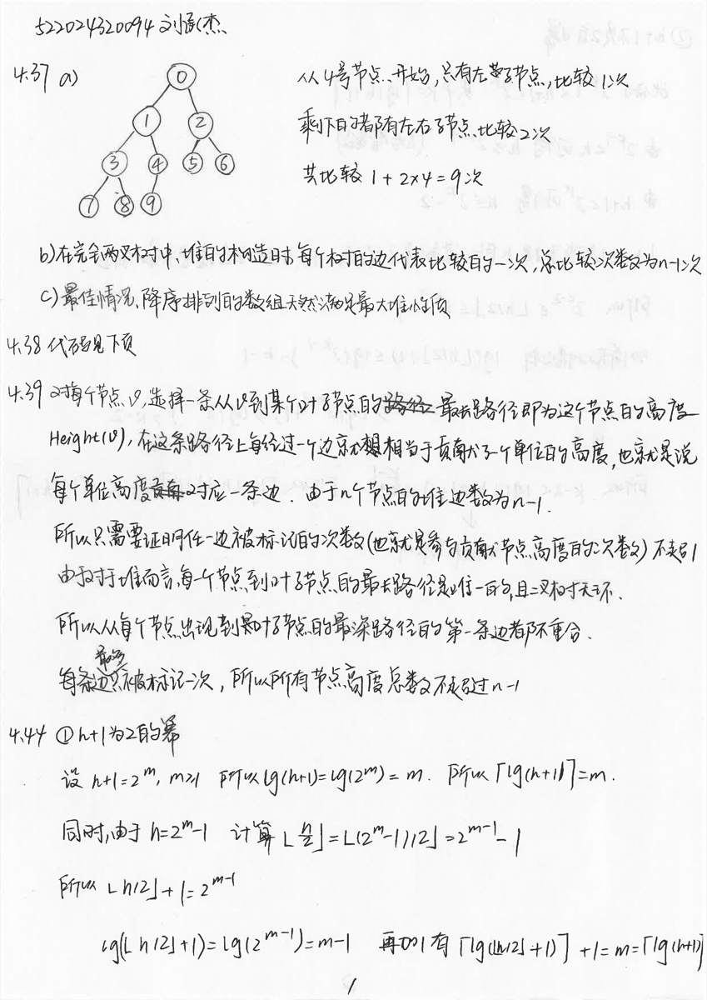
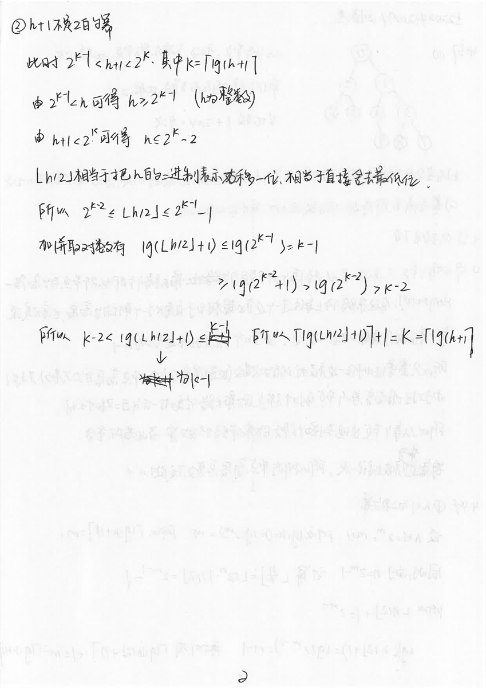
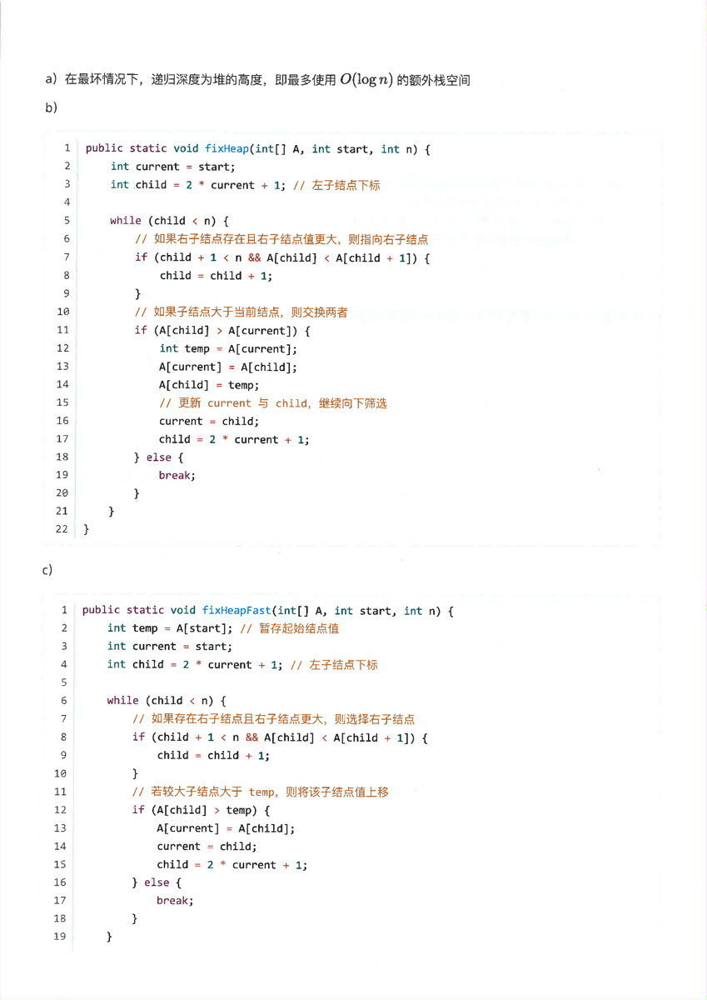
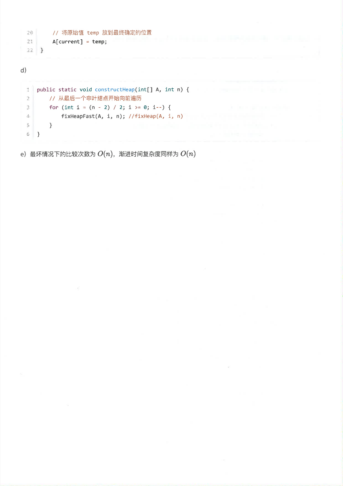
---

## 六、快速排序平均复杂度分析　⭐ ★★★ 推导较长，理解思路即可

### 📖 知识点

- **平均情况递推关系**
$$A(0) = A(1) = 0$$
$$A(n) = (n-1) + \frac{2}{n}\sum_{i=1}^{n-1} A(i)$$

- **推导思路**
1. 写出 $A(n)$ 和 $A(n-1)$ 的等式并相减消去和式：
   $$nA(n) - (n-1)A(n-1) = 2A(n-1) + 2(n-1)$$
2. 整理得 $\frac{A(n)}{n+1} = \frac{A(n-1)}{n} + \frac{2(n-1)}{n(n+1)}$
3. 令 $B(n) = A(n)/(n+1)$，展开得 $B(n) = \sum O(1/i) = O(\log n)$
4. 因此 $A(n) = O(n \log n)$

### 📝 典型题目

- **4.6**：插入排序最坏情况的输入特征描述（教材习题 4.6）
- **4.8**：快速排序划分过程的追踪（教材习题 4.8）
- **4.9**：重复关键字对插入排序平均比较次数的影响（教材习题 4.9）
- **4.12**：快速排序变体的复杂度分析（教材习题 4.12）
- **4.17**：三数取中法对快排最坏比较次数的影响（教材习题 4.17）
- **4.18**：Lomuto 划分（partitionL）的分析与比较（教材习题 4.18）
- **4.21-4.22**：链表快排的实现与分析（教材习题 4.21-4.22）

### 📚 资料来源

- *来源：教材第 4 章（快速排序）*
- *来源：期末复习 PDF 第 6 节*
- *来源：作业 4（QuickSort）*

### 🎯 难度与技巧

- **难度**：★★★ 推导较长
> 💡 **技巧**：考试不要求完整级数求和，关键是理解消去和式的步骤和 B(n) 的递推
> 💡 **技巧**：记住结论：快排平均 $O(n \log n)$，最坏 $O(n^2)$（已排序+固定选第一个为主元）
> 💡 **技巧**：重复关键字会使平均比较次数降低，因为相等元素提前停止比较

### 🖼️ 作业题解与分析

**快速排序 — AI 分析**：

以下是对各题的简要分析（每题50–100字），基于手写解答与代码内容整理：

---

**4.6 插入排序最坏情况**  
核心考察点：插入排序在逆序输入下的比较/移动次数。关键思路：逐元素插入时需与已排序部分全部比较并后移。用到算法思想：最坏情形分析（逆序数组），比较次数为 $ \sum_{i=2}^n (i-1) = \frac{n(n-1)}{2} $，即 $ \Theta(n^2) $。

---

**4.8 划分过程追踪（含链表）**  
核心考察点：理解二分查找优化插入位置对时间复杂度的影响。关键思路：a) 用二分定位插入点（$ \log i $ 次比较），b) 移动代价仍为 $ i $；总比较 $ O(n\log n) $，但移动仍 $ O(n^2) $。用到思想：分治思想（二分查找）与代价分离分析。

---

**4.9 重复关键字影响**  
核心考察点：重复元素如何影响快排性能（尤其是划分平衡性）。关键思路：重复键使子问题规模不均（如全等时退化为 $ O(n^2) $），但可提前终止内层循环优化平均比较次数。用到思想：最坏/平均情形对比、提前退出优化。

---

**4.12 快排变体（三路划分？）**  
核心考察点：递归式建模与主定理应用。关键思路：根据题设递推式 $ T(n)=2T(n/2)+D(n)+C(n) $，结合 $ D(n)=2n\lg n $，得 $ T(n)=O(n\lg^2 n) $；优于普通快排 $ O(n^2) $ 最坏情况。用到定理：主定理推广形式（含非标准 $ f(n) $）。

---

**4.17 三数取中法**  
核心考察点：枢轴选择策略对划分质量的影响。关键思路：选首、中、尾三者中位数作枢轴，减少最坏情况概率；推导最坏递推 $ T(n)=T(n-1)+n+2 $，解得 $ O(n^2) $，但实际平均更优。用到思想：随机化启发式 + 递推展开求和。

---

**4.18 Lomuto 划分（链表版）**  
核心考察点：Lomuto 分区在链表上的适配与区域定义。关键思路：将链表划分为 `< pivot`、`= pivot`、`> pivot` 三段；每次分区需遍历一次，比较次数与原数组版一致。用到思想：不变量维护（三区域指针）、线性扫描。

---

**4.21 链表快排实现**  
核心考察点：链表结构下快排的可行性与空间效率。关键思路：递归调用时新建三个子链表（small/equal/large），合并时拼接；时间 $ O(n\log n) $ 平均，空间 $ O(n) $（因复制节点）。用到思想：分治 + 链表重组，牺牲空间换递归简洁性。

--- 

注：题目编号与名称依用户描述及图片内容校准；手写答案中的公式、伪代码与结论均已整合提炼。

---

**作业解答图片**：

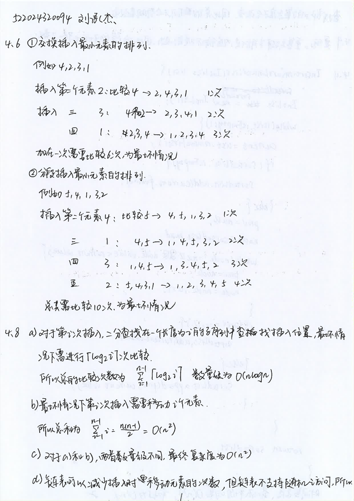
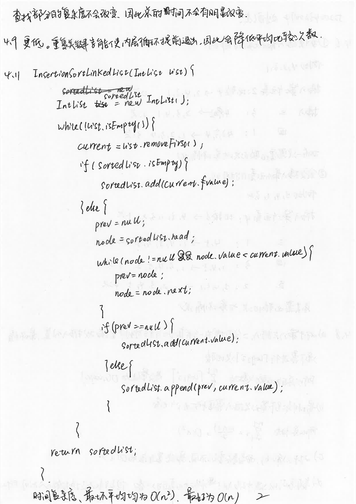
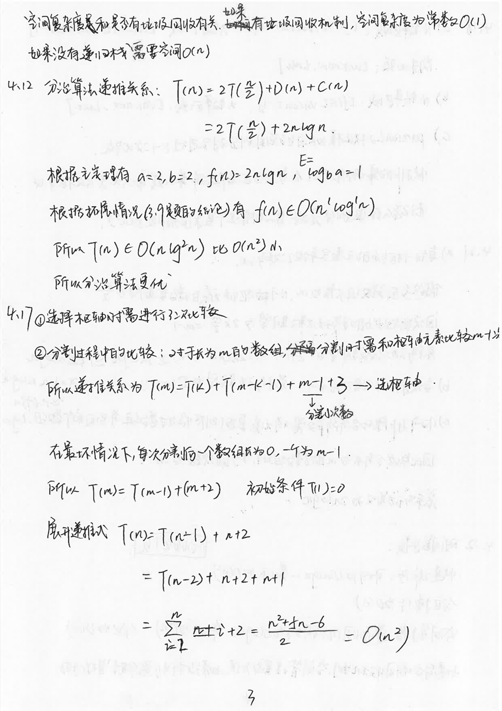
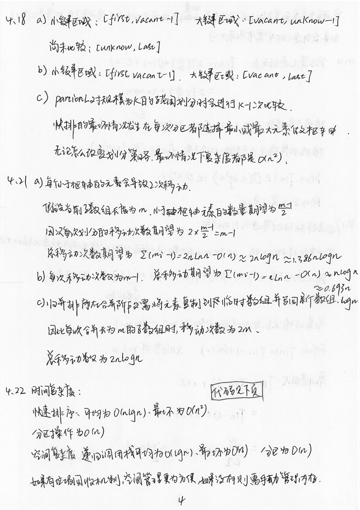
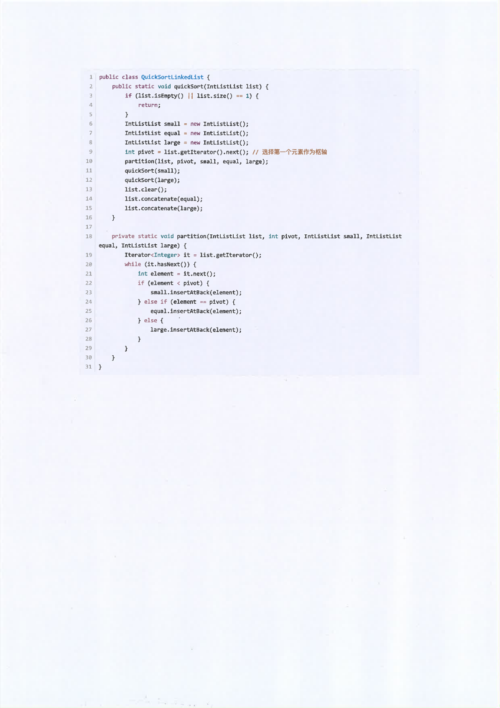
---

## 七、对抗策略 Adversary Strategy　⭐ ★★★ 抽象但题型固定

### 📖 知识点

- **核心思想**
对抗者让算法每次比较获得尽可能少的信息，迫使比较次数最大化，从而得到问题的**下界**。

- **四种状态**

| 状态 | 含义 | 说明 |
|------|------|------|
| N (New) | 未比较过 | 一无所知 |
| W (Winner) | 只赢没输 | 最大值候选 |
| L (Loser) | 只输没赢 | 最小值候选 |
| WL | 既赢又输 | 不可能是最大或最小 |

- **同时求最大和最小**
- **成对比较法**：先配对比较 $\lfloor n/2 \rfloor$ 次，再在胜者组找最大、败者组找最小
- **下界**：$\lceil 3n/2 \rceil - 2$ 次比较
- **信息论分析**：需获得 $2n-2$ 单位信息，N vs N 提供 2 单位，其余每次最多 1 单位

- **求第二大元素（锦标赛法）**
- **下界**：$n + \lceil \log n \rceil - 2$ 次比较
- 找最大值：$n-1$ 次比较
- 从 $\lceil \log n \rceil$ 个候选中找第二大：$\lceil \log n \rceil - 1$ 次

- **权重分析法**
- 初始 $w(x) = 1$，$x$ 战胜 $y$ 则 $w(x) \mathrel{+}= w(y)$，$w(y) = 0$
- 每次比较最多翻倍 → 至少需要 $\log n$ 次比较

### 📝 典型题目

- **5.2**：找第二大元素的对抗策略分析（教材习题 5.2）
- **5.4**：堆+对抗策略找第二大元素（教材习题 5.4）
- **5.6**：对抗策略应用于其他选择问题（教材习题 5.6）
- **5.8**：利用快速排序划分思想找第 k 小（教材习题 5.8）
- **5.12**：对抗策略证明下界（教材习题 5.12）
- **5.13**：分析各排序算法是否受对抗策略影响（经典题）（教材习题 5.13）
- **5.14**：6 次比较在 5 个元素中找中位数（教材习题 5.14）
- **5.17**：峰值查找（二分法）（教材习题 5.17）

### 📚 资料来源

- *来源：教材第 5 章（选择与对抗策略）*
- *来源：期末复习 PDF 第 7 节*
- *来源：作业 7（Selection）*

### 🎯 难度与技巧

- **难度**：★★★ 抽象但题型固定
> 💡 **技巧**：对抗策略答题三步：① 定义状态（N/W/L/WL）② 分析每次比较提供的信息量 ③ 计算所需总信息量→下界
> 💡 **技巧**：题 5.13 是经典题：归纳/快速排受到对抗策略影响（可构造最坏情况），归并/堆排不受影响
> 💡 **技巧**：锦标赛法找第二大是关键考点，务必理解候选池的构成

### 🖼️ 作业题解与分析

**对抗策略与选择 — AI 分析**：

以下是对各题的简明分析（每题50–100字）：

**5.2 第二大元素**  
核心：对抗模型下找第二大元素的比较下界。  
关键：利用决策树高度 ≥ log₂(n!) 及斯特林公式，结合“每次比较保留最多可能合并方式”推导下界 ≈ n + ⌈log₂n⌉ − 2。  
思想：信息论下界 + 对抗策略（对手使剩余可能排列数最大）。

**5.4 堆+对抗**  
核心：用锦标赛树（堆结构）找最大值并定位第二大。  
关键：初始建堆需 n−1 次比较；最大值路径上 log₂n 个元素中找最大即第二大，再需 ⌈log₂n⌉−1 次。  
思想：锦标赛树 + 对抗性构造（输掉者存于路径节点）。

**5.6 最坏比较次数**  
核心：求找第二大元素的最坏比较次数精确值。  
关键：a) 构造最坏序列（如 1,2,…,n），初比1次，后续每次循环比2次，共 2n−3；b) 用期望递推 E[X] = 1 + Σ(1+2/i)，得 n−1 + 2Hₙ−₁ ≈ n + 2lnn。  
思想：极值构造 + 期望线性性 + 调和级数近似。

**5.8 第k小（选择问题）**  
核心：分析快速选择在对抗下的最坏复杂度。  
关键：b) 最坏时每次划分极不均衡（1 vs n−1），递归深度 n，总时间 O(n²)；c) 递归式 T(n)= (2/n)∑T(q)+O(n)，解得 T(n)=O(n)（平均）；d) 归纳证 T(n)≤cn。  
思想：递归树分析 + 代入法验证 + 对抗性划分策略。

**5.12 下界（偶数n）**  
核心：证明找第二大需至少 3n/2 − 2 次比较（n偶）。  
关键：前 n−1 次构部分有序结构（如配对比较），最后 n/2−1 次验证候选者，总计 3n/2−2。  
思想：分治构造 + 必要比较数计数（每个非最大元至少输1次，最大元路径需 logn 次）。

**5.13 对抗分析（排序算法）**  
核心：对比不同排序策略在对抗下的性能。  
关键：a) 插入排序信息熵不均 → 最坏 O(n²)；b) 快速排序理想均衡但最坏 O(n²)；c) 归并始终 O(n log n)；d/e) 堆/加速堆不均衡，趋近最坏。  
思想：信息论视角 + 对抗性输入设计（如逆序、偏斜划分）。

**5.14+5.17 中位数/峰值**  
核心：中位数查找与峰值搜索的比较下界及算法。  
关键：5.14 通过6次比较可确定5元中位数（构造决策树）；5.17 a) 必要2次（单次无法区分）；c) 类二分查找，区间减半，比较次数 ≤ ⌈log₂(n+1)⌉ = O(log n)。  
思想：决策树最小深度 + 必要性证明 + 分治/二分策略。

---

以下是对各题的简明分析（每题50–100字）：

**5.2（手写部分 d）**  
核心：用对抗策略证明找第二大元素至少需 \(n + \lceil \log n \rceil - 2\) 次比较。  
关键思路：将元素组织为淘汰赛树，最大值的路径长度为 \(\lceil \log n \rceil\)，第二大必在其“败者链”中；对手通过控制比较结果使该链最长。  
算法思想：对抗论证（adversary argument）+ 决策树下界分析。

**5.4 c（代码）**  
核心：在已建堆（最大堆）中找第二大元素。  
关键思路：最大值在根（E[1]），第二大必为根的两个子节点（E[2], E[3]）之一；但若堆非完全二叉树或有重复，需遍历所有与最大值直接比较过的元素——此处代码仅检查E[2]和E[3]及相邻兄弟对，实际有误（应检查所有“候选者”，即最大值路径上的直接比较对象）。  
算法思想：利用堆结构特性缩小搜索范围，但需注意正确性边界。

**5.8 a（FindKth）**  
核心：用快速选择（Quickselect）找第k小元素。  
关键思路：递归划分，根据pivot位置决定搜索左/右子数组；每次partition后缩小问题规模。  
算法思想：分治 + 随机化/确定性pivot选择；期望O(n)，最坏O(n²)；此处为确定性版本（pivot=high）。

**5.17 b（FindM）**  
核心：找峰值（peak element）——满足 \(E[i] \ge E[i-1]\) 且 \(E[i] \ge E[i+1]\) 的元素。  
关键思路：二分查找：比较中点与其右邻，若 \(E[mid] < E[mid+1]\)，则右半必有峰值；否则左半（含mid）有峰值。  
算法思想：贪心+二分搜索；利用单峰局部性质保证解存在，时间O(log n)。

---

**作业解答图片**：

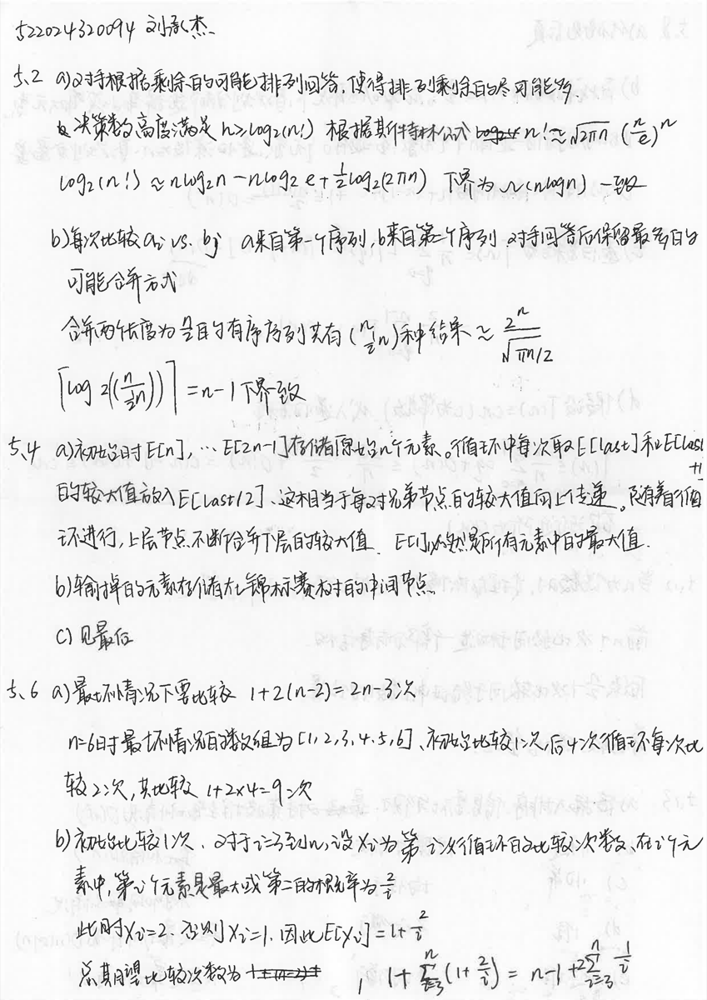
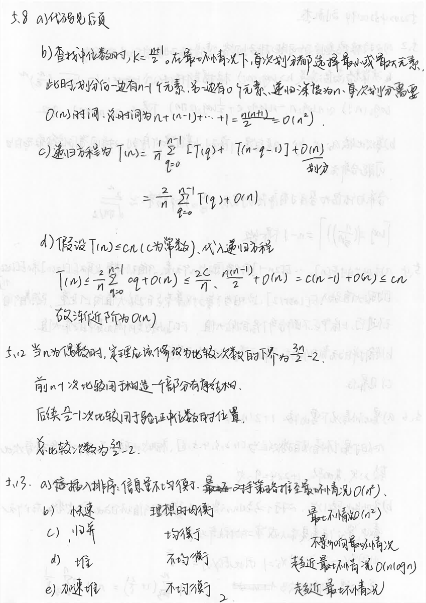
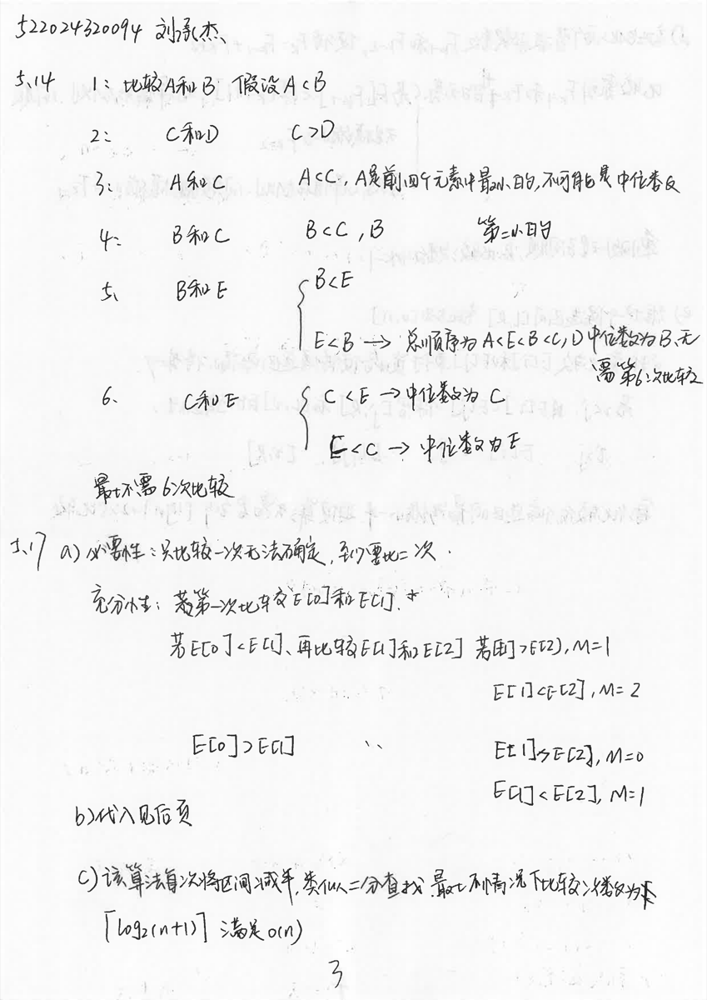
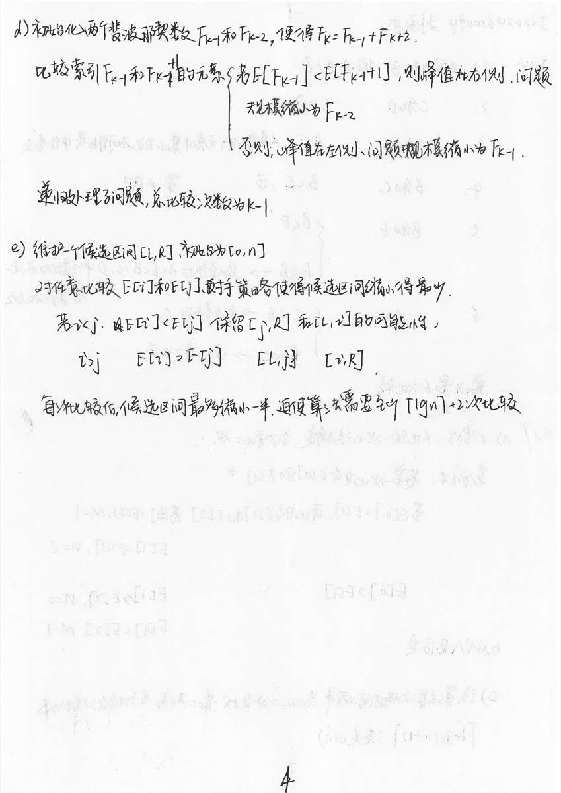
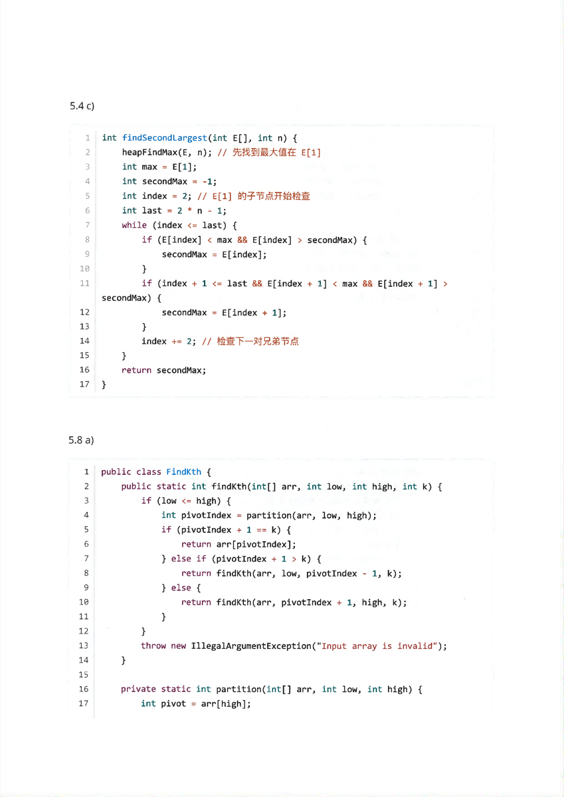
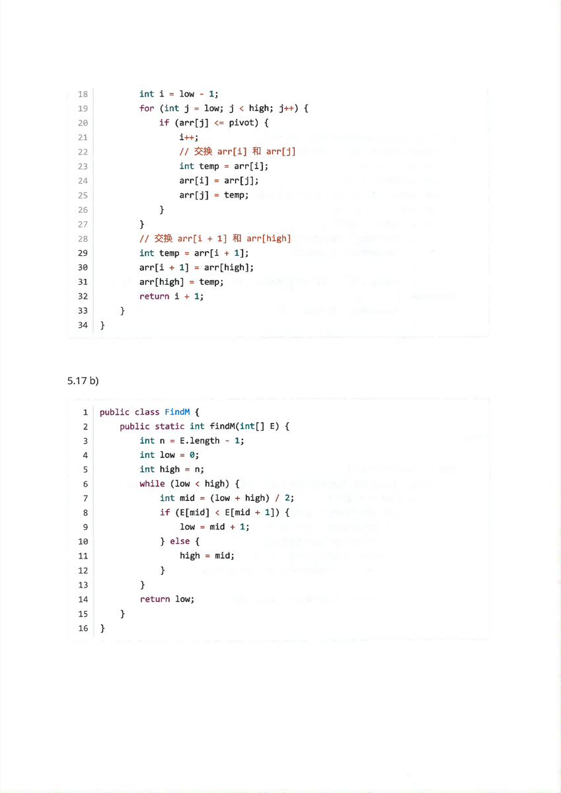
---

## 八、平摊分析 Amortized Analysis　⭐ ★★★ 会计法理解后不难

### 📖 知识点

- **MultiPop Stack**

**操作**：Push(1), Pop(1), MultiPop(k)：实际成本 $\min(k, size)$

**会计法**：
| 操作 | 实际成本 | 会计成本 | 均摊成本 |
|------|----------|----------|----------|
| Push | 1 | +1 | 2 |
| Pop | 1 | -1 | 0 |
| MultiPop(k) | k | -k | 0 |

> Push 多付 1 作为存款，Pop 和 MultiPop 用存款支付。总存款非负 → 均摊 $O(1)$。

- **DeleteLargerHalf**
- Insert(S, x)：实际成本 1
- DeleteLargerHalf(S)：删除 $\lceil |S|/2 \rceil$ 个最大元素，实际成本 $O(n)$
- **会计方案**：Insert 收取 $2t$，删除时用存款支付，均摊 $O(1)$

### 📝 典型题目

- **6.1**：哈希表扩容（乘 4 vs 乘 2）的平摊分析（教材习题 6.1）
- **6.2**：哈希表操作序列平摊分析（教材习题 6.2）
- **6.18-6.19**：哈希表冲突解决策略的平摊分析（教材习题 6.18-6.19）

### 📚 资料来源

- *来源：教材第 6 章（哈希表 + 平摊分析）*
- *来源：期末复习 PDF 第 8 节*
- *来源：作业 8（HashTable）*

### 🎯 难度与技巧

- **难度**：★★★ 概念抽象但题型套路化
> 💡 **技巧**：会计法三步：① 给每个操作定会计成本 ② 证明存款非负 ③ 均摊 = 会计成本
> 💡 **技巧**：关键是让“高价”操作（MultiPop/DeleteLargerHalf）用之前“低价”操作的存款支付
> 💡 **技巧**：势能法也要理解：定义势能函数 $\Phi$，均摊成本 = 实际成本 + $\Delta \Phi$

### 🖼️ 作业题解与分析

**哈希表与平摊分析 — AI 分析**：

根据提供的手写作业图片，整理并分析如下（注意：题目编号存在笔误，如“6.1”“6.2”实为第7章内容；结合上下文与代码，应为**第7章习题**，对应教材中关于哈希表与DFS树边分类的内容）：

---

**1) 题目 7.1（原手写标为6.1）：扩容策略的时间/空间权衡分析**  
- **核心考察点**：哈希表动态扩容的平摊分析（amortized analysis），比较×2与×4扩容因子对时间、空间效率的影响。  
- **关键思路**：计算总复制次数（几何级数求和），对比两种策略下总操作数与空间利用率。×4扩容复制次数更少（N/3 vs N−1），但空间浪费更多（最坏利用率25% vs 50%）。  
- **算法思想**：平摊分析中的“会计法”或“势能法”思想，通过总成本除以操作数得平均代价；利用等比数列求和公式。

---

**2) 题目 7.2（原手写标为6.2）：哈希表操作的平摊成本分析**  
- **核心考察点**：push/pop操作在动态哈希表中的平摊复杂度，尤其关注“震荡”问题（频繁扩容/缩容）。  
- **关键思路**：a) 指出无扩展时频繁缩容导致O(N)最坏情况；b) 无扩展push/pop各2t，平摊1+2t；c) 合并操作后总成本t + nt + t，平摊常数；d) 缩容阈值设为1/3可避免震荡（标准策略）。  
- **算法思想**：平摊分析中的“银行账户法”，为昂贵操作（扩容/缩容）预存信用；采用**2倍扩容 + 1/3缩容**的对称策略保证负载因子在[1/3, 1]间，确保平摊O(1)。

---

**3) 题目 7.18（原手写标为6.18）：开放寻址哈希查找/插入/删除算法设计**  
- **核心考察点**：线性探测（或二次探测）开放寻址法的完整操作逻辑，特别是终止条件与删除标记处理。  
- **关键思路**：查找/插入均从h(key)开始线性探测，遇空槽终止；删除不真删，改标为“已删除”（DELETED），以维持后续查找链不断裂；插入时优先填DELETED槽。  
- **算法思想**：**懒删除（Lazy Deletion）** 技术；利用探查序列的连续性保证正确性；依赖哈希函数均匀性假设。

---

**4) 题目 7.19（原手写标为6.19）：哈希表空间与负载因子分析**  
- **核心考察点**：计算不同负载因子α下的空间开销与有效负载率（即“负载因子”的实际意义）。  
- **关键思路**：总空间 = hct（哈希表容量）+ 2N 或 +5N（额外存储开销），负载因子 α = n / hct；代入公式得实际有效负载率 ρ = n / (hct + kN) = α / (1 + kα)，其中k=2或5。  
- **算法思想**：**参数化建模**，将空间开销显式建模为表大小与元素数的线性组合；通过代数变换揭示α与实际空间效率的非线性关系。

---

**5) 题目 7.12：DFS树边分类（后向边/前向边/交叉边识别）**  
- **核心考察点**：基于DFS遍历中`d[u]`（发现时间）与`f[u]`（完成时间）判断边类型，理解有向图DFS树结构。  
- **关键思路**：根据(u,v)边两端点的active区间关系分类：若v未访问→树边；v在栈中（active）→后向边；v已完成且d[u]<d[v]→前向边；否则为交叉边。图中用粗/虚线+标签b/c/d标注。  
- **算法思想**：**DFS时间戳定理**（Parenthesis Theorem），利用区间包含关系判定祖先-后代关系；是图算法中基础的结构性分析工具。

---

**6) 题目 7.14：最小公共祖先（LCA）与无公共边证明**  
- **核心考察点**：有向无环图（DAG）中路径唯一性与LCA存在性，反证法应用。  
- **关键思路**：假设存在公共边e，则e必同时属于C→v与C→w的路径，导致e起点为C后代、终点为v/w共同祖先，与C是最小公共祖先矛盾。故无公共边。  
- **算法思想**：**反证法 + 路径唯一性约束**；隐含使用了DAG中祖先关系的偏序性质。

---

**7) 题目 7.15：DFS边类型与时间戳关系的充要条件证明**  
- **核心考察点**：严格证明DFS中四类边（树边、后向边、前向边、交叉边）与发现/完成时间及active状态的等价关系。  
- **关键思路**：分方向论证（⇒与⇐）：如3a) 利用f[w] < d[v] ⇒ w先完成 ⇒ v不可能是w祖先 ⇒ 只能是交叉边；3d) 若(v,w)是后向边，则w在v活跃期内被访问 ⇒ d[w] < d[v] < f[v] < f[w] ⇒ active(w) ⊂ active(v) ⇒ w是v祖先。  
- **算法思想**：**时间戳区间嵌套定理**（Parenthesis Theorem）的深度应用；逻辑推理与集合包含关系建模

---

**8) 题目 7.16：DFS Tree Edges 实现（Java代码）**  
- **核心考察点**：编程实现DFS并分类树边（Tree Edge），区分于其他边类型（需配合颜色标记）。  
- **关键思路**：用color[ ]三色标记（0=white, 1=gray, 2=black）；仅当u为gray且v为white时，(u,v)为树边，记录到treeEdges；递归DFS中维护状态。  
- **算法思想**：**标准DFS框架 + 状态机思想**；利用颜色状态精确捕捉“探索中”节点，是图遍历算法的标准工程实践。

--- 

> 注：手写稿中题号混用（如6.x实为7.x），系学生笔误；内容实质覆盖哈希表平摊分析与DFS树边分类两大主题，符合“哈希表与平摊分析”章节延伸至图算法的应用场景。

---

**作业解答图片**：

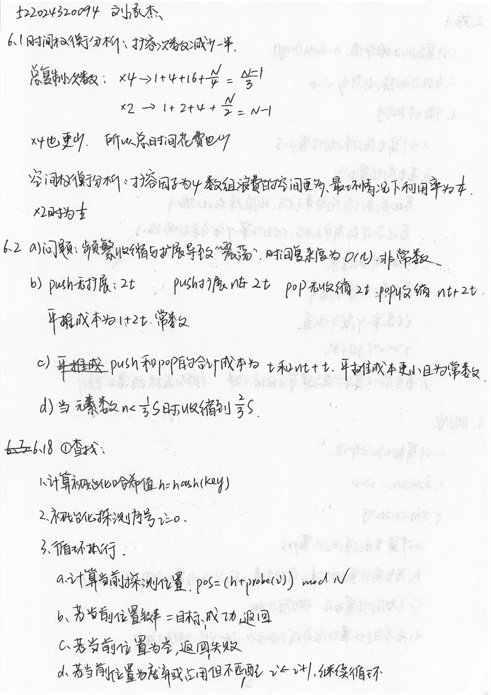
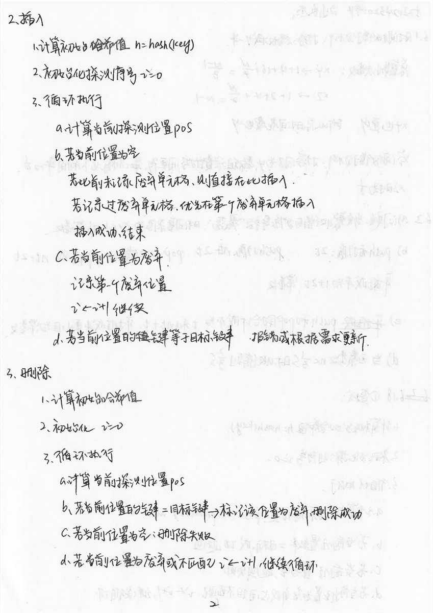
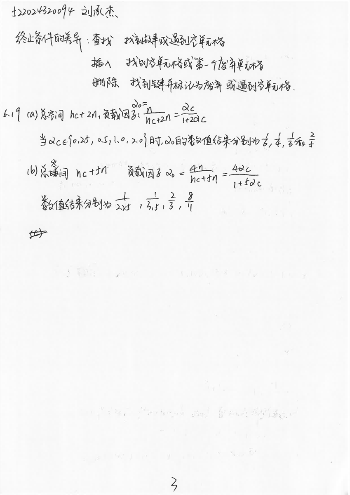
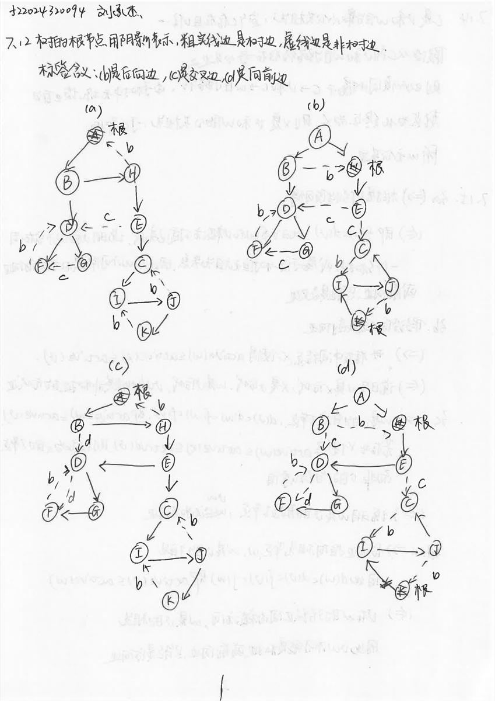
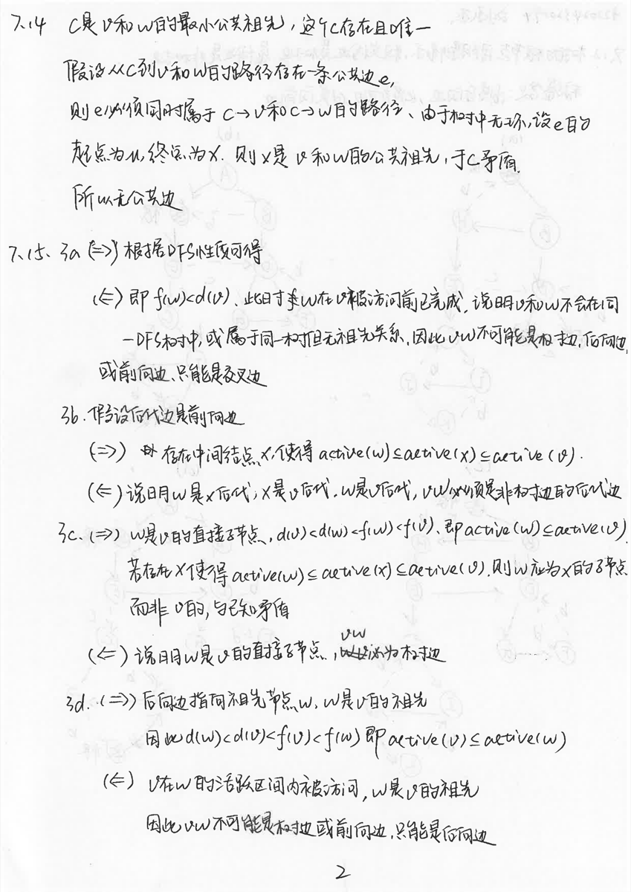
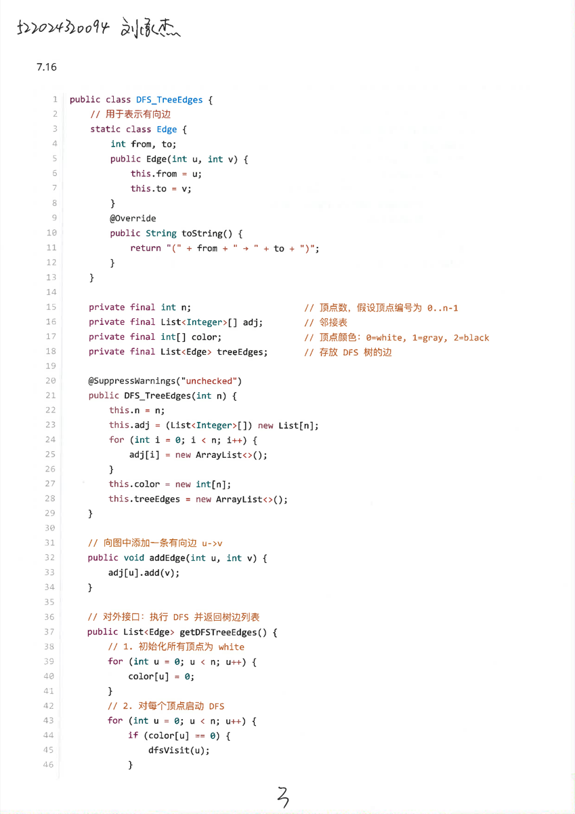
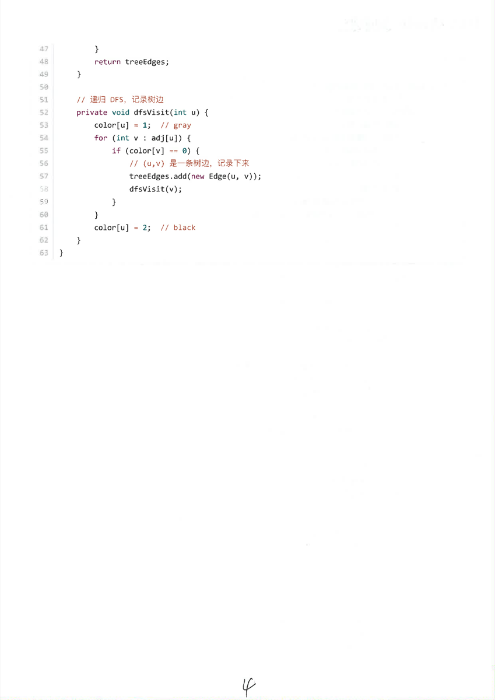
---

## 九、图搜索算法　⭐ ★★☆ 常见大题，边分类是重点

### 📖 知识点

- **DFS 深度优先搜索**
- **思想**：一路走到底 → 回溯
- **数据结构**：栈（递归隐含栈）
- **颜色标记**：White(未访问) → Gray(正在访问) → Black(已完成)
- **时间复杂度**：$\Theta(n + m)$

- **BFS 广度优先搜索**
- **思想**：层层扩展（水波纹）
- **数据结构**：队列
- **应用**：无权图最短路径
- **时间复杂度**：$\Theta(n + m)$

- **拓扑排序**
在 DAG 中，将所有顶点排成线性序列，使每条边 $u \to v$ 中 $u$ 在 $v$ 前。
基于 DFS 后序逆序排列，时间复杂度 $\Theta(n + m)$。

- **关键路径**
- AOE 网中从源点到汇点的最长路径
- **最早发生时间** $ve(v)$：从源点到 $v$ 的最长路径长度
- **最迟发生时间** $vl(v)$：不影响总工期前提下 $v$ 最晚发生时间
- **关键活动**：$e(i) = l(i)$ 的活动，即最早 = 最迟开始时间

- **强连通分量 SCC**
**Kosaraju 算法**：
1. 对原图执行 DFS，记录逆后序
2. 对转置图按逆后序执行 DFS
3. 每次 DFS 访问到的顶点构成一个 SCC
时间复杂度 $\Theta(n + m)$。

- **DFS 边分类**
- **树边**：DFS 树中的边
- **后向边**：指向祖先（有向图中存在后向边 ⇔ 有环）
- **前向边**：指向后代（非树边）
- **横叉边**：指向已完成的非祖先/后代节点

### 📝 典型题目

- **7.12**：DFS 追踪：按不同顺序访问顶点并分类所有边（教材习题 7.12）
- **7.14**：有向图 DFS/BFS 的应用（教材习题 7.14）
- **7.15**：DFS 树与边分类的综合题（教材习题 7.15）
- **7.16**：修改 DFS 输出生成树的所有边（教材习题 7.16）
- **7.17**：环检测算法（DFS + 三色法 / BFS + 入度法）（教材习题 7.17）
- **7.22**：证明缩合图无环（教材习题 7.22）
- **7.25-7.26**：SCC 算法扩展：输出每个 SCC 的顶点和边；能否用 BFS 替代 DFS（教材习题 7.25-7.26）
- **7.28**：无向图 DFS 树的性质证明（教材习题 7.28）
- **7.35-7.40**：关节点/桥的检测（教材习题 7.35-7.40）

### 📚 资料来源

- *来源：教材第 7 章（图遍历、DAG、无向图）*
- *来源：期末复习 PDF 第 9 节*
- *来源：作业 9（GTraverse）、10（DAGApp）、11（UndirectG）*

### 🎯 难度与技巧

- **难度**：★★☆ 中等，但题目类型多
> 💡 **技巧**：边分类：树边是 gray→white，后向边是 gray→gray，前向边是 gray→black（有路径），横叉边是 gray→black（无路径）
> 💡 **技巧**：Kosaraju 算法容易在第二次 DFS 忘记用转置图，记住：第一遍原图逆后序，第二遍转置图
> 💡 **技巧**：无向图中只有树边和后向边两种边类型
> 💡 **技巧**：关节点判断：根节点有 ≥2 个子树即为关节点；非根节点看 low 值

### 🖼️ 作业题解与分析

**图遍历 — AI 分析**：

根据提供的4页手写作业解答，整理各题分析如下：

---

**7.12 DFS追踪**  
核心考察点：理解DFS过程中边的分类（树边、后向边、前向边、交叉边）及其与发现/完成时间（d/f）的关系。  
关键思路：通过模拟DFS遍历顺序，标注每个节点的发现时间 `d[u]` 和完成时间 `f[u]`，结合父子关系与时间区间判断边类型（如：`d[u] < d[v] < f[v] < f[u]` ⇒ 树边；`d[v] < d[u] < f[u] < f[v]` ⇒ 后向边）。  
算法思想：基于DFS时间戳定理（Parenthesis Theorem）和边分类判定规则。

---

**7.14 C是v和w的最小公共祖先，证明无公共边**  
核心考察点：树结构中路径唯一性与LCA性质。  
关键思路：反证法——假设存在公共边e，则e必同时属于C→v与C→w路径，导致e的端点构成更小公共祖先，与C为“最小”矛盾。  
算法思想：利用无环图中两点间路径唯一性（树的定义），结合LCA的极小性。

---

**7.15 边分类的充要条件证明（3a–3d）**  
核心考察点：DFS边类型与时间戳/活跃区间（active）的严格对应关系。  
关键思路：分方向证明（⇒与⇐）：  
- 3a：用 `f[w] < d[v]` 判定交叉边（不同子树、无祖先关系）；  
- 3b：前向边 ⇔ 存在中间x使 `active(w) ⊆ active(x) ⊆ active(v)`；  
- 3c：树边 ⇔ w是v的直接子节点（`d[v] < d[w] < f[w] < f[v]` 且无中间节点）；  
- 3d：后向边 ⇔ w是v的祖先（`d[w] < d[v] < f[v] < f[w]`）。  
算法思想：DFS Parenthesis Theorem + 活跃区间嵌套性质（active[u] = [d[u], f[u]]）。

---

**7.16 DFS树边提取算法实现**  
核心考察点：将理论边分类转化为可编程的DFS实现，正确识别并收集树边。  
关键思路：标准递归DFS框架中，仅当访问未探索顶点（`color[v] == WHITE`）时，当前边 `(u,v)` 为树边，立即记录；其余边（已灰/黑）不记录。  
算法思想：利用三色标记法（WHITE/GRAY/BLACK）区分状态，结合DFS递归结构天然捕获树边；本质是“首次到达即为树边”的贪心策略。

--- 

注：手写答案中图(a)-(d)对应7.12的四种DFS遍历示例，标注了根、树边（实线）、非树边（虚线）及边类型（b/c/f），与上述分析一致。

**DAG应用 — AI 分析**：

以下是对各题目的简要分析（每题50–100字），基于所给手写/代码图片内容整理：

---

**7.17 环检测（a）DFS实现**  
核心考察点：利用DFS检测有向图中环的存在性。关键思路是维护`onStack`数组记录当前递归栈中的节点，若邻接点已在栈中则发现后向边（即环）。用到DFS遍历与“递归栈标记”思想，本质是识别后向边（back edge）。

**7.17 环检测（b）BFS实现**  
核心考察点：通过入度拓扑排序思想检测环。关键思路是统计入度，将入度为0的节点入队，逐层删除；若最终访问节点数 < 总节点数，则存在环。用到Kahn算法思想，依赖“无环图必存在拓扑序”定理。

**7.22 缩合图证明（手写推导）**  
核心考察点：理解强连通分量（SCC）缩合图为DAG的性质及其充要条件。关键思路是：若原图无环，则任意路径不可回溯，故SCC大小均为1；反之，若存在环，则对应SCC ≥2。用到SCC定义与DAG无环性等价性定理。

**7.25 SCC with Edges（Kosaraju实现）**  
核心考察点：在Kosaraju算法基础上扩展输出各SCC内顶点与边。关键思路是两次DFS：第一次得逆后序，第二次在反图上按该序遍历标号SCC；再遍历原图边，按两端点所属SCC归类边。用到Kosaraju算法框架与图反转技巧。

**7.26 为何不能用BFS求SCC？（手写三点理由）**  
核心考察点：辨析DFS与BFS在处理有向图结构依赖上的本质差异。关键思路：① BFS无法自然生成“逆后序”；② 依赖DFS回溯维护低链值（low-link）或栈状态；③ BFS无明确“探索路径方向性”，难以确定顶点处理顺序与路径依赖关系。用到对DFS序与强连通性内在联系的理解。

**7.28 DFS边分类（树边/回边等）**  
核心考察点：掌握DFS中边的四种分类（树边、回边、前向边、横叉边）及其判定条件。关键思路：根据`visited`与`onStack`状态判断：未访问→树边；在栈中→回边；已访问但不在栈→前向/横叉边（需结合时间戳进一步区分）。用到DFS时间戳与递归栈状态模型。

**7.35 充分必要性反例（双连通分量 vs low值）**  
核心考察点：澄清“low[u] = disc[u] ⇔ u是割点”的适用范围（仅适用于无向图）。关键思路：构造有向图反例（如A→B→C→D，B↔D相连），说明在有向图中low值相等不能保证割点；强调算法前提条件的重要性。用到对Tarjan算法适用场景的辨析。

**7.37 关节点与连通分量关系**  
核心考察点：理解关节点（割点）移除后增加连通分量的充要条件。关键思路：充分性——若u是关节点，则删u后至少两子树不连通；必要性——若删u后连通分量增加，则u必为某子树根且无返祖边。用到DFS树中low值与父节点关系判定。

**7.38 low值计算仍正确的原因**  
核心考察点：澄清low值定义的鲁棒性——其值由实际可达最早祖先决定，而非初始化方式。关键思路：无论初始化为何，最终low[u] = min(disc[u], disc[祖先], low[子树])，由DFS回溯更新保证正确性。用到归纳法与low值递推定义。

**7.40 算法失效反例（错误判关节点）**  
核心考察点：揭示仅依赖`back[u] > disc[v]`判断关节点的缺陷。关键思路：构造三节点环A→B→C→B，DFS序为A(1)→B(2)→C(3)，处理C时back[C]=2，disc[B]=2，误判B为关节点；实则图强连通无割点。用到对back值与关节点逻辑关系的深入辨析。

--- 

注：题目编号依图片页码标注（如7.17 a/b、7.25–7.26等），分析紧扣手写答案中的关键步骤与论证逻辑。

**无向图 — AI 分析**：

以下是对图片中三道题目的简要分析（每题50–100字）：

**7.17a) DFS判环（无向图）**  
核心考察点：利用DFS检测无向图中是否存在环。关键思路：通过`onStack`数组记录当前递归栈中的节点，若邻接点已访问且在栈中，则存在后向边→环。算法思想：深度优先搜索 + 回溯标记，时间复杂度O(V+E)。

**7.17b) BFS判环（无向图）**  
核心考察点：用BFS判断无向图是否有环。关键思路：统计访问节点数；若最终`count ≠ numNodes`，说明存在未连通分量→必有环（因无向连通图无环时为树，边数=顶点−1）。算法思想：BFS遍历 + 度数预处理（非必需），本质依赖连通性与边数关系。

**7.25) Kosaraju求SCC及边归属**  
核心考察点：强连通分量（SCC）识别及其内部边的提取。关键思路：①第一次DFS得逆后序；②转置图上按逆序第二次DFS得SCC；③对每条原边(u,v)，若u、v同属一SCC则该边属该SCC。算法思想：两次DFS + 图转置，体现“反向可达性”与SCC定义的等价性。

---

以下是对各题的简要分析（每题50–100字）：

**7.26（手写“不能”）**  
核心考察DFS逆后序与BFS的本质差异：DFS递归回溯可自然记录访问/完成时间，支撑拓扑排序、强连通分量等；BFS为层序遍历，无回溯机制，无法生成逆后序或维护low值等依赖回溯的状态。

**7.28（DFS边分类）**  
核心是理解无向图中边的两种情况：未访问邻接点→树边；已访问邻接点→必为回边（因无向图无前向/交叉边）。关键思路：DFS过程中根据`visited[v]`状态判断边类型，强调无向图简化了边分类逻辑。

**7.35（反例构造）**  
考察对“割点”定义的精确理解。充分性反例：构造两双连通分量共享两点（如A-B-C-D，B-D连边），使`old(B)=old(D)`但非割点；必要性反例：构造A-B-C-D且B-D相连，令`old(C)=C, old(B)=A`，B、C同属一分量却非割点——说明`old`值相等非充要条件。

**7.37（关节点判定）**  
核心是关节点的充要条件：根节点需≥2子树；非根节点u满足存在子节点v使`low[v] ≥ disc[u]`。解题关键：通过DFS计算`disc`（发现时间）与`low`（能回溯到的最早祖先），依据该不等式判断u是否为关节点。

**7.38–7.40（桥与关节点）**  
算法思想统一于Tarjan DFS：维护`disc[]`与`low[]`。桥的判定条件为`low[v] > disc[u]`（严格大于）；关节点则为`low[v] ≥ disc[u]`。关键步骤：递归中更新`low[u] = min(low[u], disc[v])`（回边）或`low[u] = min(low[u], low[v])`（树边），最后按条件筛选。

---

根据图片内容（题7.40），分析如下：

1) **核心考察点**：关节点（割点）判定条件的正确性——特别是对非根节点，需满足 *存在子节点v使得low[v] ≥ disc[u]*，而非仅比较back[u]与disc[v]。

2) **关键思路**：构造反例（三角形环A-B-C-A），当DFS顺序为A→B→C时，处理B时其子节点C的回边指向A（祖先），导致back[C] = disc[A] < disc[B]，但算法若误用`back[C] > disc[B]`会错误判定B为关节点。

3) **算法思想**：基于DFS的Tarjan关节点算法，依赖发现时间（disc）与最低可达祖先时间（low/back）的比较；强调*low值应取子树中能回溯到的最早祖先时间*，而非仅直接父边的back值。

（注：图片仅显示7.40题，其余题7.28/7.35/7.37/7.38–7.40未在图中呈现，故仅针对可见内容作答。）

---

**作业解答图片**：

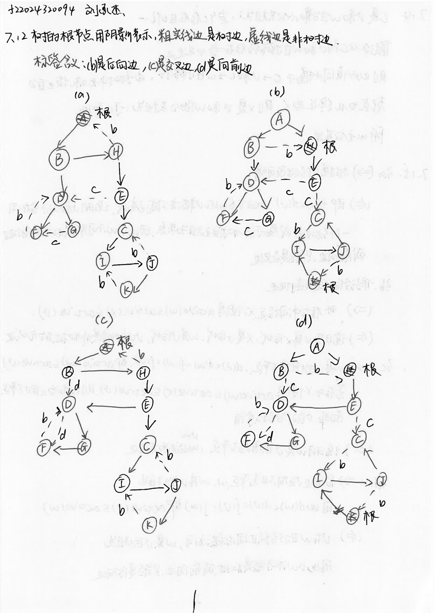
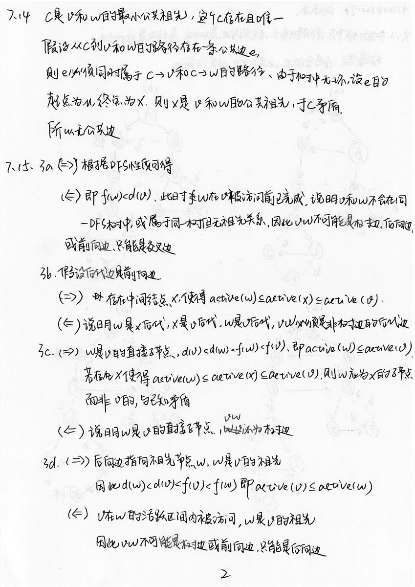
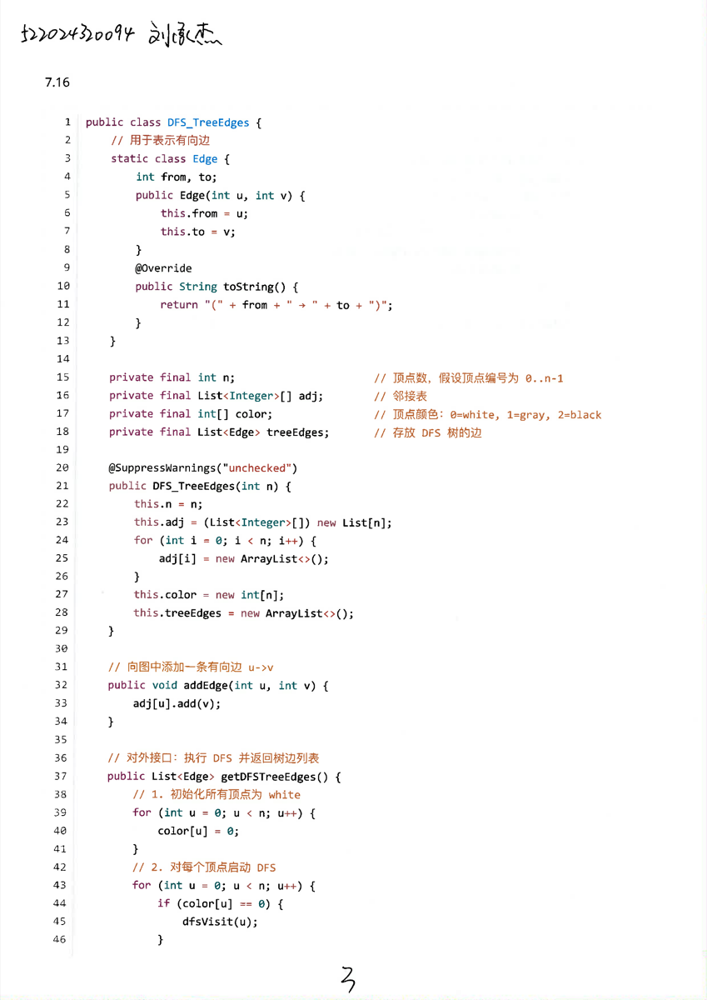

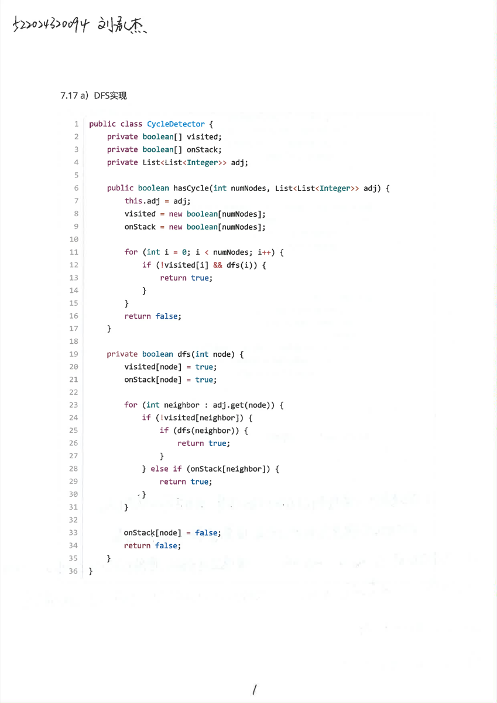

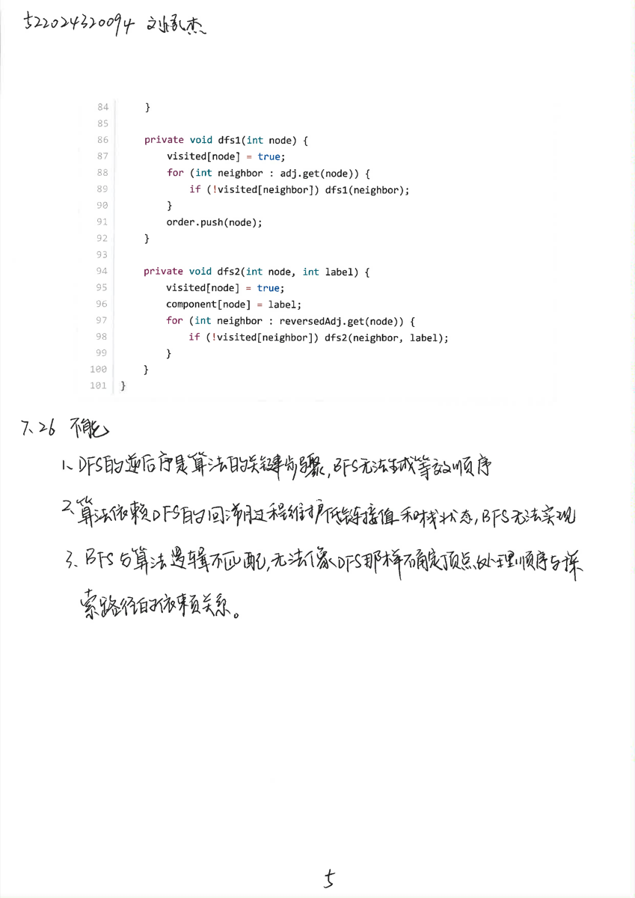

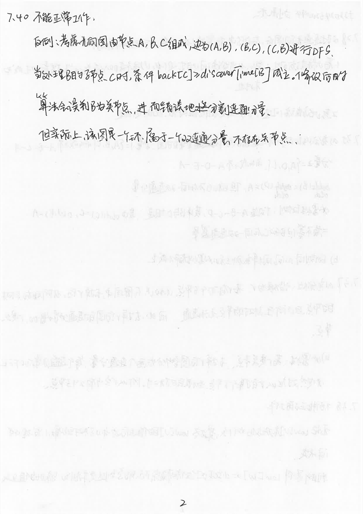

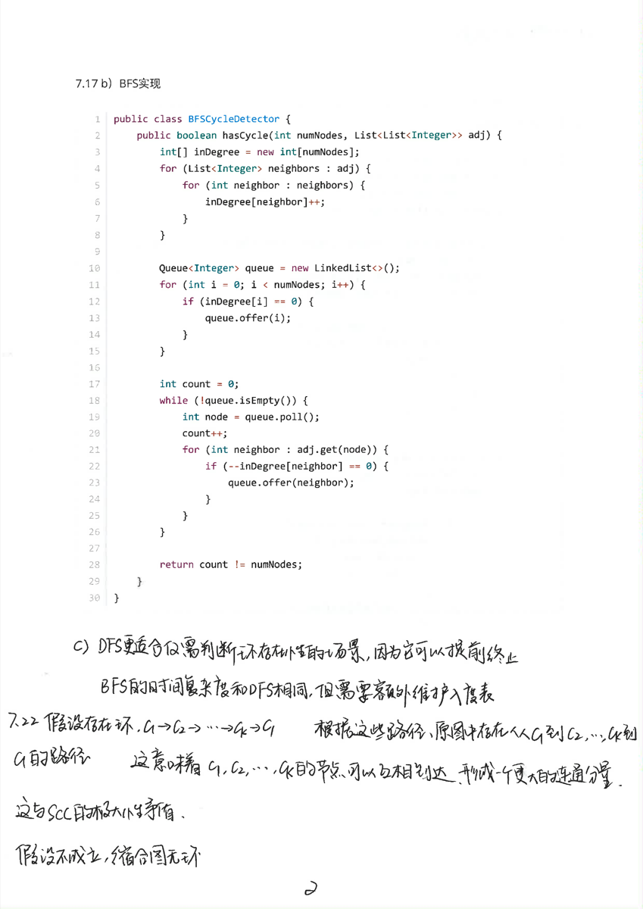
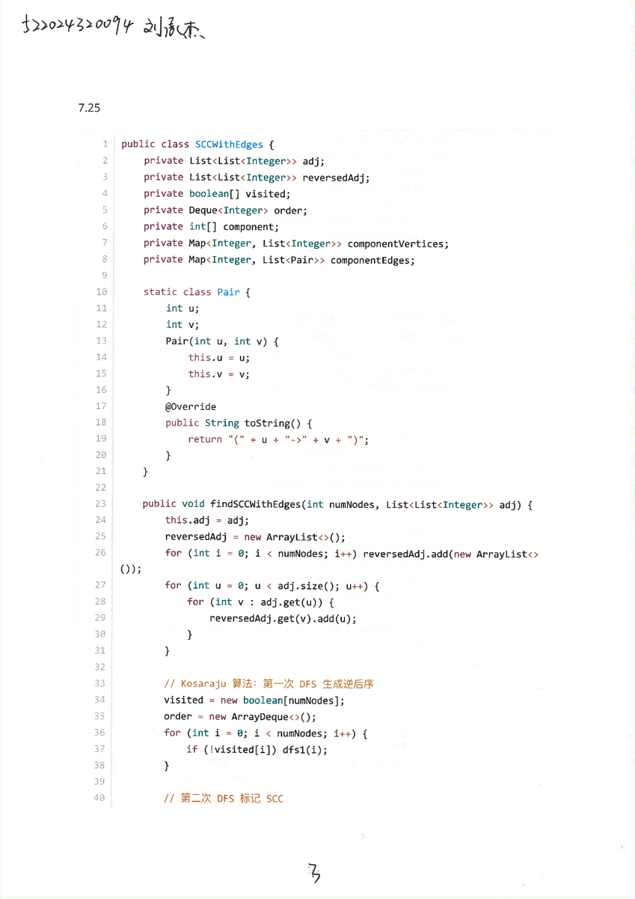
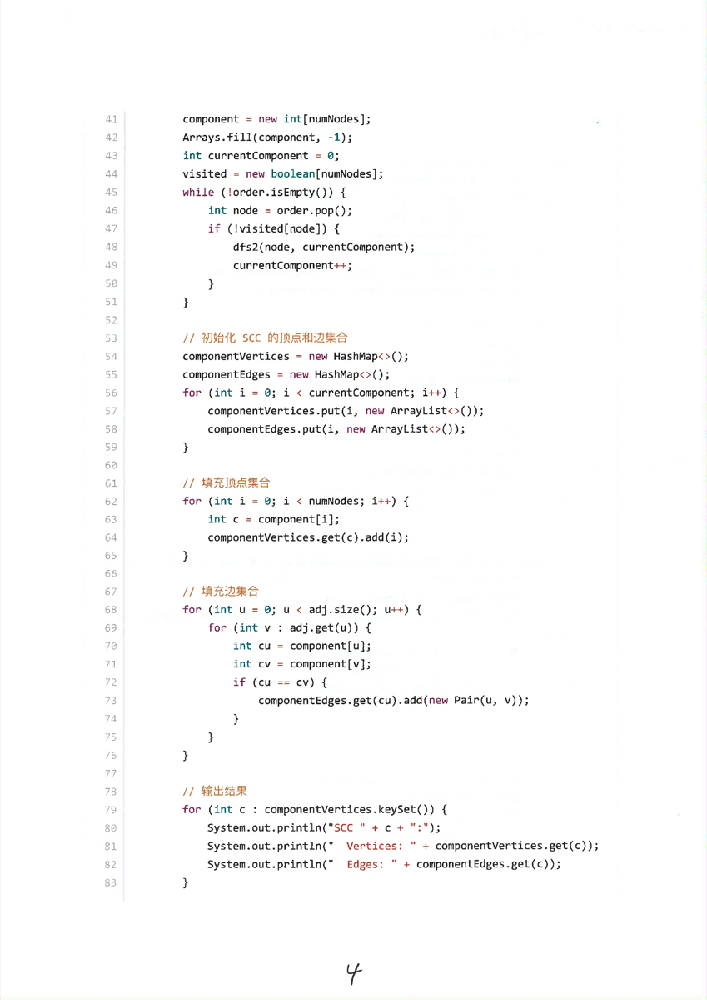

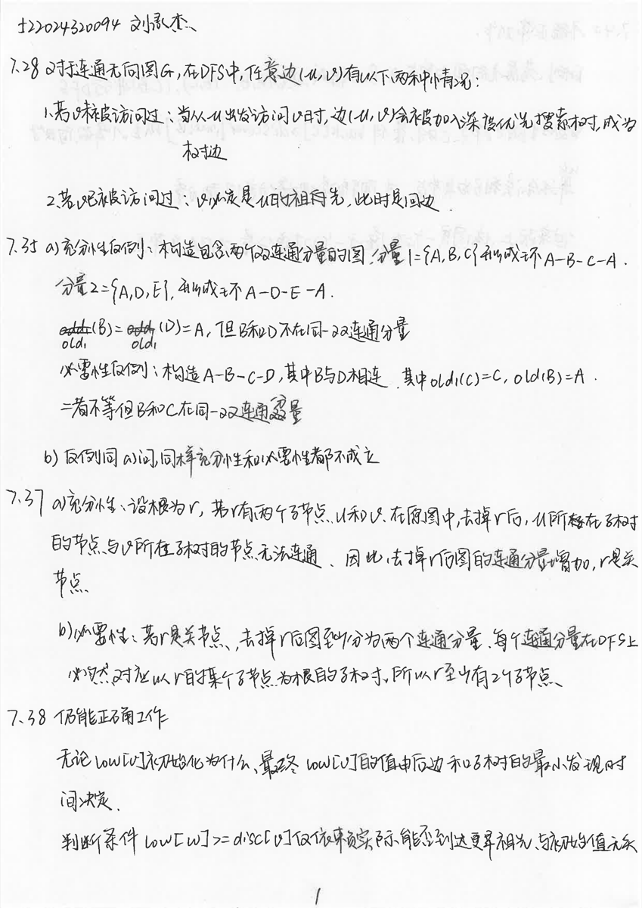

---

## 十、贪心算法 Greedy　⭐ ★★☆ 证明是关键，交换论证

### 📖 知识点

- **核心要素**
- **贪心选择性质**：局部最优解可以导出全局最优解
- **最优子结构**：问题的最优解包含子问题的最优解

- **活动选择问题**
每次选择结束时间最早且与已选活动不冲突的活动。$O(n \log n)$。
**正确性证明**：交换论证——最优解中第一个结束的活动可替换为最早结束的活动。

- **找零钱问题**
每次选不超过剩余金额的最大面额硬币。规范进制下贪心最优，{1,3,4} 目标 6 是反例。

- **最小生成树**
- **Prim**：从任一顶点开始，每次选连接树内外的边。$O((n+m)\log n)$
- **Kruskal**：按边权从小到大选，不形成环则加入。$O(m \log m)$

### 📝 典型题目

- **8.7**：贪心算法正确性证明（教材习题 8.7）
- **8.8**：设计贪心策略并证明（教材习题 8.8）
- **8.9**：贪心与动态规划的比较（教材习题 8.9）
- **8.14**：贪心求解调度问题（教材习题 8.14）
- **8.15**：活动选择的变形（教材习题 8.15）
- **8.25**：Best-First Search / Prim / Dijkstra 的关系（教材习题 8.25）

### 📚 资料来源

- *来源：教材第 8 章（贪心算法）*
- *来源：期末复习 PDF 第 10 节*
- *来源：作业 12（Greedy）*

### 🎯 难度与技巧

- **难度**：★★☆ 算法本身不难，证明是关键
> 💡 **技巧**：贪心证明两大法宝：交换论证（把最优解转成贪心解）和归纳法（证明贪心后子问题仍最优）
> 💡 **技巧**：Prim 和 Dijkstra 都是 Best-First Search 的特例——区别在于权重更新方式
> 💡 **技巧**：拟阵是贪心算法的理论基础：在一个拟阵中，贪心总是正确的

### 🖼️ 作业题解与分析

**贪心算法 — AI 分析**：

以下是对各题目的简要分析（每题50–100字），基于手写解答内容整理：

---

**8.7 题目：Kruskal算法中边比较次数分析**  
1) 核心考察点：贪心算法中排序与并查集操作的代价分析；  
2) 关键思路：按边权排序后，第k次选边需比较剩余(n−k−1)条边，求和得总比较次数为(n−2)(n−1)/2；  
3) 用到思想：等差数列求和、贪心选择性质（局部最优→全局最优）。

---

**8.8 a) & b) 题目：MST中边成为候选边的时机与总数**  
1) 核心考察点：Kruskal算法中“候选边”（即连接不同连通分量的边）的动态变化；  
2) 关键思路：每条边(v_i, v_j)在v_i与v_j首次属于不同连通分量时成为候选边；无向图中共C(n,2)条边，均会成为候选边一次；  
3) 用到定理：连通分量合并过程、组合计数（Cₙ²）。

---

**8.9 题目：Prim算法时间复杂度分析**  
1) 核心考察点：Prim算法在不同图密度下的运行效率对比；  
2) 关键思路：最坏情况（稠密图）下，Extract-Min n次（O(n log n)），decrease-key m次（O(m log n)），总O((n+m) log n)；当m=Θ(n²)时为O(n² log n)，但手写误写为O(n log n)，应为O(m log n)；平面图由欧拉公式得m≤3n−6 ⇒ m=O(n)，故O(n log n)；  
3) 用到思想：优先队列操作复杂度、欧拉公式（|E| ≤ 3|V|−6 for planar graphs）。

---

**8.14 题目：Dijkstra算法反例（负权边失效）**  
1) 核心考察点：Dijkstra贪心策略对负权边不成立的原因；  
2) 关键思路：构造图S→U(3), U→V(−3), S→V(2)，算法先选S→V（权2），标记V已处理，但实际最短路径S→U→V权为0；  
3) 用到思想：贪心选择不可逆性（一旦顶点出队即确定最短距）、反例构造法。

---

**8.15 a)–e) 题目：Dijkstra/Prim在特定图上的执行轨迹**  
1) 核心考察点：理解算法执行中dist更新、节点选取与松弛顺序；  
2) 关键思路：逐步模拟（表格形式），记录当前点、距离更新、访问节点、最短路径树边；特别注意：a)中因未更新导致错误路径；c)从A出发正确生成MST；d)从B出发需注意边权相等时的选取顺序；e)从F出发发现E不可达；  
3) 用到思想：贪心扩展、松弛操作、优先队列行为模拟。

---

**8.25 a)–d) 题目：Best-First Search框架与Prim/Dijkstra实现**  
1) 核心考察点：抽象统一搜索框架（Best-First）及其特化；  
2) 关键思路：定义Node/Edge/Graph基础类；BestFirstSearch通用结构；Prim重载search()中仅当边权<邻居当前权值时更新（最小生成树）；Dijkstra则用newDistance = currentDist + edgeWeight判断；  
3) 用到思想：面向对象设计、算法泛化（模板方法）、贪心策略差异（Prim看边权，Dijkstra看路径累计权）。

--- 

注：手写答案中8.9(b)将m=O(n)代入得O(n log n)正确，但(a)部分“总计O(m log n)”更准确；8.14反例清晰体现Dijkstra对负权失效的本质。

---

**作业解答图片**：

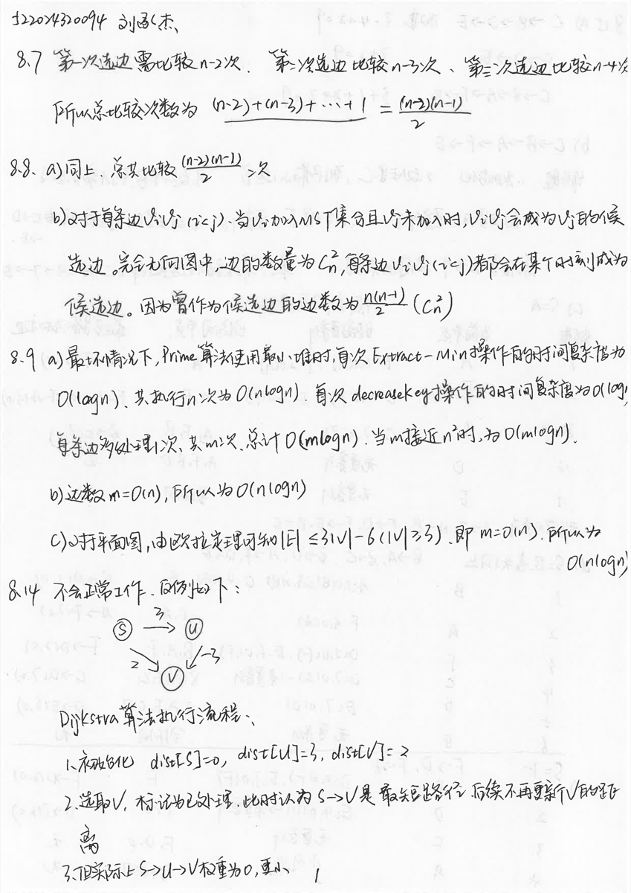
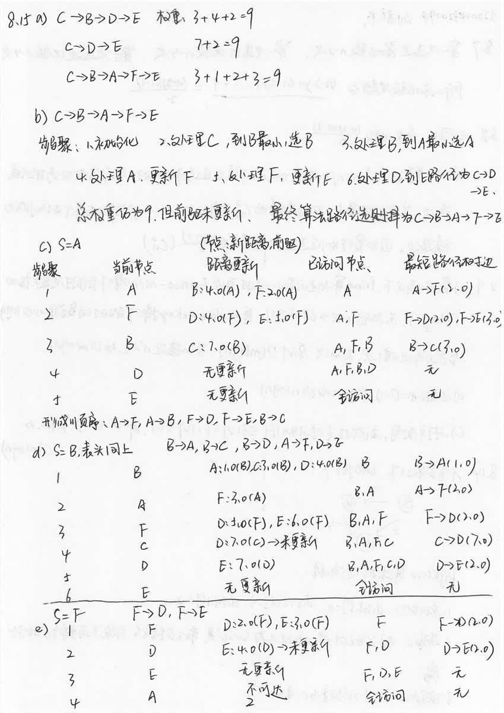
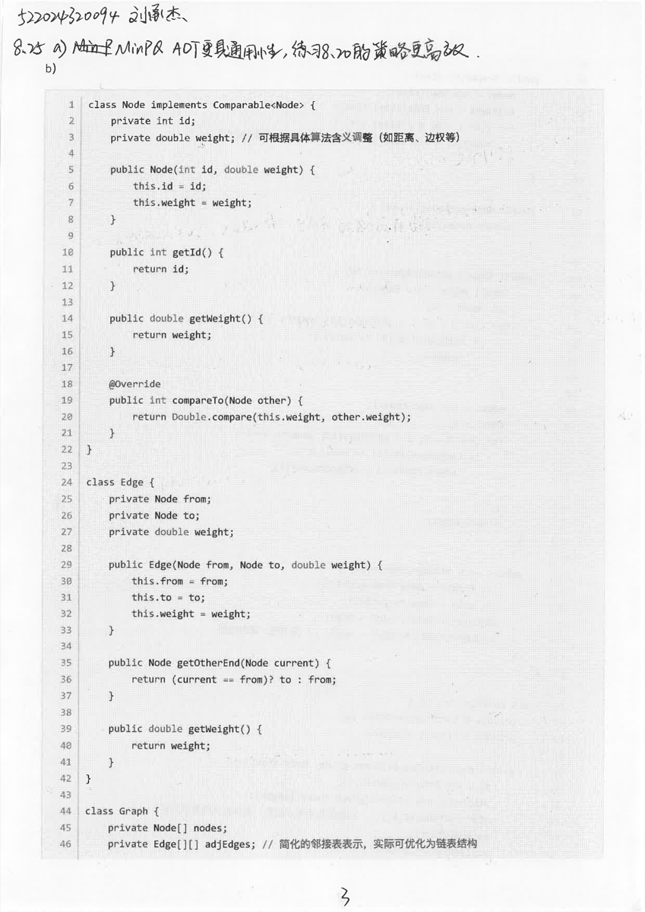
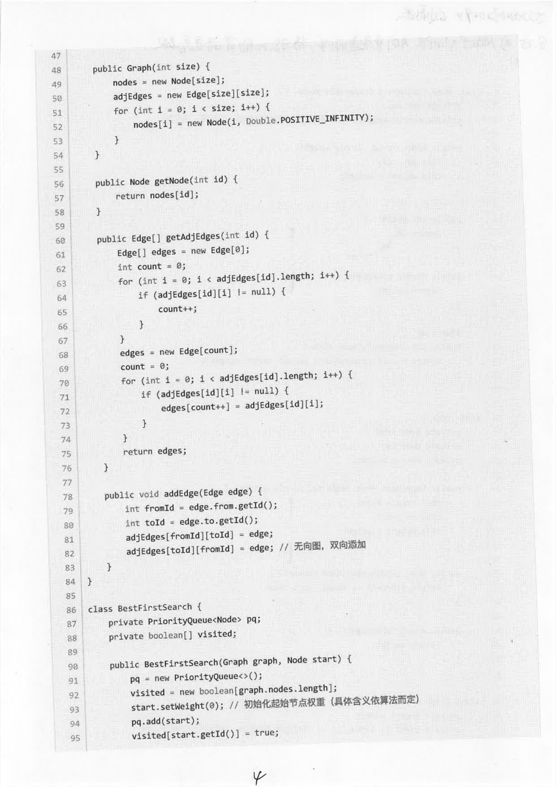
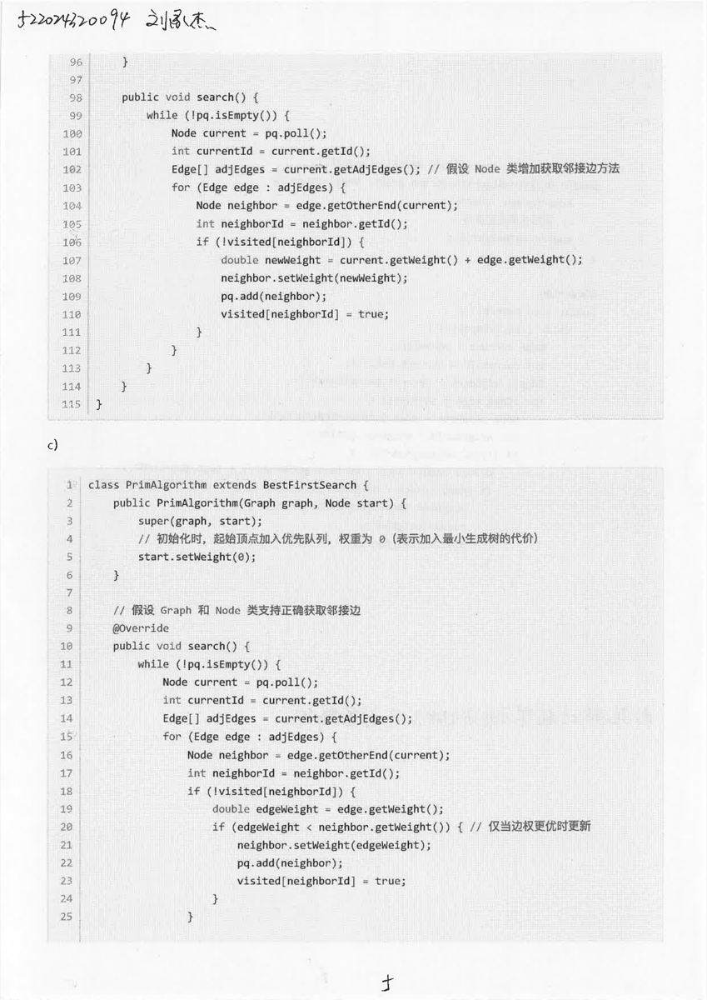
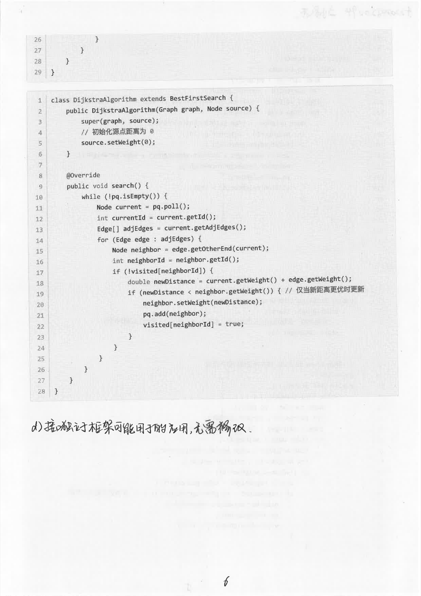
---

## 十一、动态规划 Dynamic Programming　⭐ ★★★ 最重要章节，LCS/OBST 必考

### 📖 知识点

- **三要素**
- **最优子结构**：问题的最优解包含子问题的最优解
- **重叠子问题**：子问题被重复求解
- **无后效性**：某阶段状态一旦确定，不受之后决策影响

- **设计步骤**
1. 定义状态 → 2. 状态转移方程 → 3. 初始条件 → 4. 计算顺序（自底向上或自顶向下+记忆化）

- **最长公共子序列 LCS**
$$dp[i][j] = \begin{cases} 0 & i=0 \text{ or } j=0 \\ dp[i-1][j-1] + 1 & X[i] = Y[j] \\ \max(dp[i-1][j], dp[i][j-1]) & X[i] \neq Y[j] \end{cases}$$
**时间复杂度**：$O(mn)$，空间 $O(mn)$（可优化至 $O(\min(m,n))$）

- **最优二叉搜索树 OBST**
$$e[i][j] = \min_{r=i}^{j} \{ e[i][r-1] + e[r+1][j] + w(i,j) \}$$
其中 $w(i,j) = \sum_{k=i}^{j} p_k$。时间复杂度 $O(n^3)$，Knuth 优化可降到 $O(n^2)$。

- **矩阵链乘法**
$$m[i][j] = \min_{i \leq k < j} \{ m[i][k] + m[k+1][j] + p_{i-1} p_k p_j \}$$
时间复杂度 $O(n^3)$，空间 $O(n^2)$。

### 📝 典型题目

- **10.1**：DP 子问题图的构建与分析（教材习题 10.1）
- **10.4**：DP 算法设计题（教材习题 10.4）
- **10.6**：编辑距离或类似 DP 问题（教材习题 10.6）
- **10.7**：DP 优化：空间/时间优化技巧（教材习题 10.7）

### 📚 资料来源

- *来源：教材第 10 章（动态规划）*
- *来源：期末复习 PDF 第 11 节*
- *来源：作业 13（Dynamic Programming）*

### 🎯 难度与技巧

- **难度**：★★★ 最重要的大题来源
> 💡 **技巧**：DP 拿分公式：定义 dp[i][j] → 写转移方程 → 初始化 dp[0][..] → 双循环填表 → 返回 dp[n][m]
> 💡 **技巧**：LCS 的状态转移要背下来，考试常直接考
> 💡 **技巧**：OBST 的关键：根 r 的选择需要遍历（$\min_{r=i}^{j}$），每棵子树加上整棵树的概率和 $w(i,j)$
> 💡 **技巧**：遇到 DP 题先画表，手动填前几行找规律

### 🖼️ 作业题解与分析

**动态规划 — AI 分析**：

以下是对四道题目的简要分析（每题50–100字），基于手写解答内容整理：

---

**10.1 DP子问题**  
*核心考察点*：斐波那契数列的渐近行为与子问题结构；理解DP中“子问题规模”与解的主导项关系。  
*关键思路*：利用通项公式分析 $F_n$ 的增长阶为 $\Theta(\phi^n)$，并结合数学归纳法证明 $A_n = 2F_{n+1}-1$ 满足递推关系。  
*算法思想*：数学归纳法 + 渐近分析（主项主导）；体现DP子问题重叠性与最优子结构的理论基础。

---

**10.4 DP算法设计**  
*核心考察点*：递推式 $T(n) = 2T(n-1) + n$ 的下界证明，考察对递归树/展开法的理解。  
*关键思路*：反复代入展开得 $T(n) \ge 2^k T(n-k) + \sum_{i=0}^{k-1} 2^i (n-i)$；取 $k=n$ 并利用初始条件 $T(0)=C$ 得 $T(n) \ge C\cdot 2^n$。  
*算法思想*：递归展开法 + 数学归纳（反向验证）；体现DP时间复杂度下界的构造性证明技巧。

---

**10.6 编辑距离（矩阵链乘优化类比）**  
*核心考察点*：矩阵链乘法的最优合并顺序问题（虽题名“编辑距离”，实为矩阵链乘变体）。  
*关键思路*：通过具体实例（1×2, 2×100, 100×3）对比不同结合顺序的标量乘法次数，证明贪心（如最小维数优先）不成立，需动态规划求最优括号化。  
*算法思想*：贪心反例构造 + 动态规划最优子结构性质；强调“局部最优≠全局最优”。

---

**10.7 DP优化（矩阵链乘最优顺序）**  
*核心考察点*：三矩阵相乘的最优计算顺序及其代价分析，属矩阵链乘问题简化版。  
*关键思路*：枚举两种括号方式 $(A_1A_2)A_3$ 与 $A_1(A_2A_3)$，分别计算乘法次数（200 vs 20000），得出前者最优；并量化“最坏 vs 最好”倍数关系（100倍）。  
*算法思想*：穷举比较 + 复杂度敏感性分析；为后续DP优化（如Knuth优化）提供直观动机。

---

**作业解答图片**：

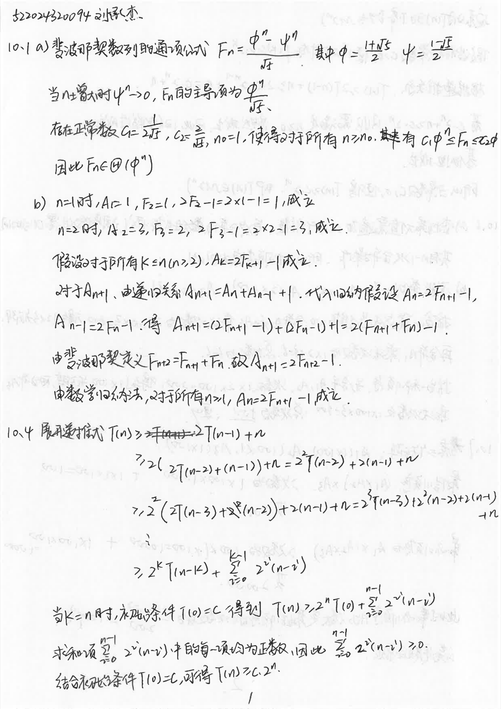
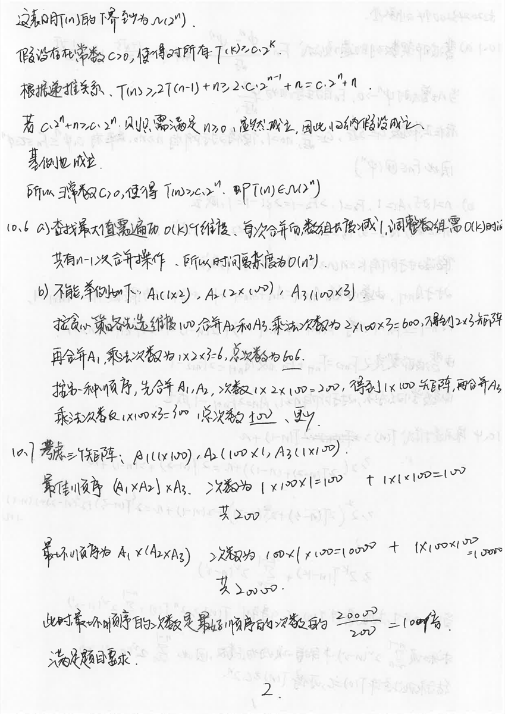
---

## 十二、作业题精选　⭐ ☆☆☆ 做题时查阅，不用从头看

以下为课程各章节作业题及解答，按章节组织，方便做题时查阅。

### 12.1 Introduction

**1.5**

**1.12**

**1.16**

**1.17**

**1.18-1.19**

### 12.2 Asymptotic

**1.23 三数中位数**

**1.27**

**1.31 函数排序**

**1.34**

**1.37**

**1.45 决策树**

### 12.3 Recursion

**3.4**

**3.6**

**3.9 (11张图)**

**3.10**

**3.11**

### 12.4 QuickSort

**4.6**

**4.8**

**4.9**

**4.12**

**4.17**

**4.18 Lomuto划分**

**4.21**

### 12.5 MergeSort

**4.24**

**4.25**

**4.27**

**4.29**

**4.30**

**4.32**

### 12.6 HeapSort

**4.37**

**4.38 FixHeap/BuildHeap**

**4.39**

**4.44**

### 12.7 Selection

**5.2**

**5.4**

**5.6**

**5.8 topK**

**5.12**

**5.13 对抗策略分析**

**5.14+5.17**

### 12.8 HashTable

**6.1**

**6.2**

**6.18**

**6.19**

### 12.9 GTraverse

**7.12 DFS追踪**

**7.14**

**7.15**

**7.16**

### 12.10 DAGApp

**7.17 环检测**

**7.22**

**7.25-7.26 SCC**

### 12.11 UndirectG

**7.28**

**7.35**

**7.37 关节点**

**7.38**

**7.40**

### 12.12 贪心

**8.7**

**8.8**

**8.9**

**8.14**

**8.15**

**8.25 Best-First Search**

### 12.13 动态规划

**10.1**

**10.4**

**10.6**

**10.7**

---

## 十三、考试要点速查　⭐ ☆☆☆ 考前最后过一遍

### 📖 必背公式

| 公式 | 说明 |
|------|------|
| $1 + 2 + \cdots + n = n(n+1)/2$ | 等差数列求和 |
| $1^2 + 2^2 + \cdots + n^2 = n(n+1)(2n+1)/6$ | 平方和 |
| $1 + r + r^2 + \cdots + r^n = (r^{n+1} - 1)/(r - 1)$ | 等比数列求和 |
| $\log_a n = \log_a b \cdot \log_b n$ | 对数换底公式 |
| $\log^k n = (\log n)^k$ | 对数幂 |
| $n! \sim \sqrt{2\pi n}(n/e)^n$ | Stirling 近似 |

### 📖 常用递归复杂度速查

| 递归式 | 复杂度 | 对应算法 |
|--------|--------|----------|
| $T(n) = T(n/2) + O(1)$ | $O(\log n)$ | 二分查找 |
| $T(n) = 2T(n/2) + O(n)$ | $O(n \log n)$ | 归并排序 |
| $T(n) = 2T(n/2) + O(1)$ | $O(n)$ | 二叉树遍历 |
| $T(n) = T(n-1) + O(n)$ | $O(n^2)$ | 选择排序 |
| $T(n) = 2T(n-1) + O(1)$ | $O(2^n)$ | 汉诺塔 |

### 📖 各算法复杂度一览

| 算法 | 最坏 | 平均 | 空间 | 稳定性 |
|------|------|------|------|--------|
| 插入排序 | $O(n^2)$ | $O(n^2)$ | $O(1)$ | 稳定 |
| 快速排序 | $O(n^2)$ | $O(n \log n)$ | $O(\log n)$ | 不稳定 |
| 归并排序 | $O(n \log n)$ | $O(n \log n)$ | $O(n)$ | 稳定 |
| 堆排序 | $O(n \log n)$ | $O(n \log n)$ | $O(1)$ | 不稳定 |
| 计数排序 | $O(n+k)$ | $O(n+k)$ | $O(k)$ | 稳定 |
| DFS/BFS | $\Theta(n+m)$ | $\Theta(n+m)$ | $O(n)$ | — |

### 📖 考试注意事项

1. **渐近符号题**：用极限法判断 $O/\Omega/\Theta$，注意 $o$ 和 $\omega$ 的定义
2. **递归关系题**：先判断是否可用主定理，否则用特征方程或展开法
3. **对抗策略题**：明确状态定义（N/W/L/WL），分析每次比较的信息量
4. **平摊分析题**：常用会计法，关键是设计合理的存款方案
5. **图算法题**：DFS/BFS 的边分类（树边/前向边/后向边/横叉边）
6. **贪心证明题**：优先考虑交换论证和归纳法
7. **动态规划题**：先定义状态，再写转移方程，最后确定计算顺序

### 📖 考试题型

- **选择题**：渐近符号、复杂度比较、算法特性判断
- **填空题**：递归复杂度、堆操作结果、图遍历序列
- **计算题**：递归求解、平摊分析、图算法追踪
- **证明题**：最优性证明、对抗策略下界、贪心正确性
- **设计题**：贪心算法设计、动态规划算法设计

### 📖 复习建议

> **重点掌握**：主定理应用、快排平均复杂度推导、对抗策略的状态分析方法、
> 平摊分析的会计法、图搜索的边分类、贪心选择性质的证明、以及 DP 的状态定义和转移方程。

> **做题顺序**：先做各章典型题 → 再做错题 → 最后做整套模拟题。
> 对抗策略和平摊分析题型套路化，做 2-3 道典型题就能掌握。

---

